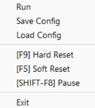
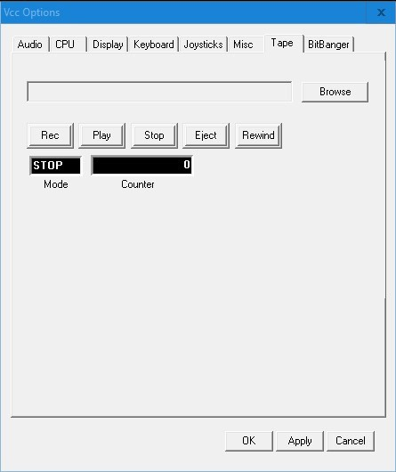
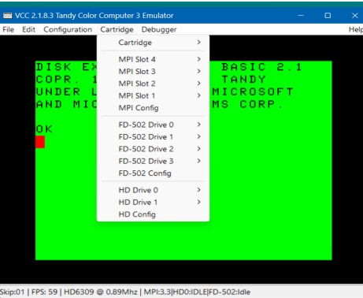
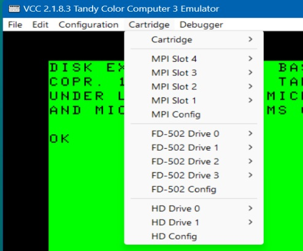

&nbsp;  

&nbsp;  

</img>

<h2 align="center">Welcome to VCC</h2>
<h3 align="center">(Virtual Color Computer)</h3>

View documents online: <https://github.com/VCCE/VCC/wiki>

The Color Computer 3 was the last of a line of micro-computers
designed by, and distributed through Radio Shack stores, released in
1986, it developed a rather large and loyal following that continues
to this day. Some of the system's specs are as follows.

 - 64k system memory, 128K via bank switching.
 - 512K upgrade available from Radio Shack as well as 1, 2. & 8 meg
    memory upgrades from 3rdparty vendors.
 - 32, 40, and 80 column hardware text modes.
 - Hi-res graphics resolutions up to 320x225 at 16 colors and 640 x 225
    at 4 colors.
 - Clock speeds of 0.89 and 1.78 MHz. Software selectable.
 - Super Extended Color Basic ROM.
 - Color Computer 2 compatibility mode.

Unfortunately in 1991 Tandy decided to discontinue the line.

Lack of support didn't seem to deter the fans. Third party vendors
stepped in to fill the void. New products were and are still being
developed. Today you can buy 512k memory cards, IDE and SCSI
hard disk interfaces and faster, more powerful CPUs in the HD63B09E.
There is even a free user supported Multi-tasking Multi-User OS
(NitrOS9) available for this more than three decade old 8 bit machine.

VCC is a Tandy Color Computer 3 emulator that runs on the Windows
operating system (Windows XP or greater). It attempts to simulate the
hardware that comprised this system. As such it allows software
written for this 30+ year old computer to run on modern hardware.
Please take a moment to read this guide to discover some of the
features and shortcomings of this emulator.

If you have ever used an emulator before you should have no trouble
understanding most of VCC's functions, however there are some
differences that you should be aware of. VCC by it's self only
emulates the Coco 3 with no peripherals. Peripherals are added by
run-time plug-ins that emulate the various add-in cards that
were/are available. See the section on Loadable Modules for an
explanation of this.

The home of "VCC" is <https://github.com/VCCE/VCC/releases/>.
There you will find the latest binary downloads as well as the
sources for VCC.

<h2 align="center">Copyrights</h2>

VCC Copyright 2012 Joseph Forgeone

VCC is free software: you can redistribute it and/or modify
it under the terms of the GNU General Public License as published by
the Free Software Foundation, either version 3 of the License, or
(at your option) any later version.

VCC is distributed in the hope that it will be useful,
but WITHOUT ANY WARRANTY; without even the implied warranty of
MERCHANTABILITY or FITNESS FOR A PARTICULAR PURPOSE.  See the
GNU General Public License for more details.

You should have received a copy of the GNU General Public License
along with this program. If not, see <http://www.gnu.org/licenses/>.

The code that comprises this emulator was written by Joseph Forgeone
with the following exceptions:

The RGB to composite color conversion algorithm, Floppy disk CRC
algorithm and the 32x16 font set were borrowed from M.E.S.S. The
MESS source was also a valuable source of technical information,
without which, this emulator would not be as good as it is today.

The "Becker Port" implementation was patched by Aaron Wolfe and David
Ladd, giving "VCC 1.4.3b" the ability to communicate to the host PC
via the DriveWire4 protocol and since then, in VCC 2.0.1, the Becker
Port was moved to a cartridge emulation "becker.dll" and must be
loaded into the MPI.

The "MS Visual Studio 2015 Community" port of the old "MS Visual C++
6" sources was done by Gary Coulborne (Thanks Gary!) and is allowing
VCC to now move forward on the more "modern" versions of Windows.

Various bugs cropped up in the move from VS6 to VS2015, and Wes Gale
stepped in to lend a hand at getting the code usable.

The HD6309 code was unfinished and incomplete and was finally put in
place by Walter Zambotti

There have been various additions, enhancements and bug fixes by
Bill Pierce, Gary Coulborne, Wes Gale, Walter Zambotti, James Ross,
Peter Westburg, James Rye, EJ Jaquay, Trey Tomes and Mike Rojas.

We welcome anyone interested in programming & enhancement of the VCCE
project. Contact us on the "Color Computer" FaceBook group with your
ideas and we will determine if it fits the direction we are headed
with the VCC project.

<h2 align="center">Credits</h2>

First and foremost, Joseph Forgeone, the original author of the VCC
Color Computer 3 emulator. Without all his hard work, this wonderful
emulator would have never come about.

Robert Gault for his contribution of the "RGBDOS" implementation and
all the testing and suggestions during Joseph's development of VCC.
Robert has contributed more to the Coco Community than anyone could know.

Aaron Wolfe and David Ladd for the addition of the "Becker Port"
for using VCC with DriveWire4. This has allowed VCC to communicate to
the outside world and has opened many doors that were closed before.

Gary Colbourn for his work in converting Joseph's Visual Studio 6 C++
code to compile in Visual Studio 2015 Community Edition.

Wes Gale for his bug hunting and squashing during the initial release
of VCC to open source.

Walter Zambotti for his contribution in fixing the HD6309 CPU to
function properly and adding in the missing instructions. Also for
inspiring us to add a second hard drive.

David Johnson for an extensive proofreading of the VCC manual and pointing
out MANY typos for me.

Mike Rojas for his great work on the VCC Debugger. This one has been a
long time coming and we hope it will get even better in the future.

Especially James Ross, James Rye, Peter Westburg (R.I.P.), Ed Jaquay,
and Trey Tomes for their endless work on the enhancements and bug fixes
of the last couple of releases. Without them, we would not be making
this release.

Last but not least, everyone in the Coco Community as the help and
support of the Coco Community is what has kept the interest in the
Color Computer going strong and made VCC possible in the first place!

Let's make VCC the BEST Color Computer 3 emulator ever! (In our
opinion, it already IS!)

VCC is maintained by the VCCE Open Source Project Team:

Administrators:

- Joe Forgeone (absent)
- Bill Pierce
- Ed Jaquay
- Gary Coulborne (absent)
- Wes Gale (absent)

Programming Contributors:

- Walter Zambotti
- James Ross
- Peter Westburg (R.I.P.)
- James Rye
- Ed Jaquay
- Trey Tomes
- MIke Rojas

VCC Manual, Repository Maintenance, Packaging & Distribution:

- Bill Pierce
- Ed Jaquay

Inspiration and Continued Support:

- The Tandy Color Computer Community

<h2 align="center">Forward</h2>

VCC version 1.4.2 was originally written by Joseph Forgeone. In or
about 2012, several of the Coco Community had contacted Joseph about
VCC since he hadn't updated the software in several years. Joseph
informed us that he would like to release the VCC source files to the
public as an "Open Source Project" so that it could be enhanced by
others. His desire was to remove the Tandy ROMs (for copyright
reasons) and make small changes in his copyrights before releasing the
sources. He told us he should have it ready for release in a couple of
months. As a "token of good faith", he offered to send us the sources
to "play with" until he made his release.

After that, Joseph seemed to disappear from the map. He had not
replied to many emails nor could any posts be found on any of the
forums as he was a regular on some Coco forums. He seemed to have
disappeared into thin air.

As the events above describe, several of us ended up with sources to
VCC. We could not release these sources without Joseph's  permission.
But in frustration of the situation, holders of the sources started
"playing" with them as Joseph had suggested. The main goal being to
add support for the Becker Port system developed by Gary Becker as well
as to fix a few minor known bugs. Since Joseph could no longer be
contacted, the decision was made to release some changes to VCC only
in "binary" form in executable packages therefore keeping the sources
from public view. Thus VCC 1.4.3b Beta w/Becker Port was born.

As the "Becker Port" patch eventually started causing a few *internal*
problems in VCC, the Becker Port developers decided to move the port
to an external "cartridge port" as a "Rom Cart", therefore removing
all influences of the Becker Port from VCC proper. So now, to use
the Becker Port, you must load the "becker.dll" into either VCC's
cartridge slot or a slot in VCC's MPI. We find this new implementation
of the Becker Port to be much more stable than the original version.

### *ENTER JOESEPH FORGEONE...*

Several of the Coco community decided that after a couple of years of
not hearing from Joseph (VCC author), that they would follow his
intentions and release the VCC sources as an "Open Source Project". In
doing so, we decided to make a public announcement in advance to allow
anyone having claims to the copyrights of VCC to step up. Amazingly,
the first person to reply was Joseph Forgeone!!

Not only did we get the "VCC Open Source Project" started, but we did
so with Joseph on board and contributing to the project. We have now
moved the VCC sources from the old "MS Visual Studio 6" programming
environment into the "MS Visual Studio 2015 Community" programming
suite which is a free download from the Microsoft website. The VCC
sources can now be compiled in Windows 7, 8, 10, & 11.

Needless to say, we now have new development of "VCC" which should be
much more compatible with modern versions of Windows. There are new
enhancements, bug fixes and there are plans to port the code to Linux
and Mac operating systems The future is bright for VCC!!

This document is meant to be an enhanced version of Joseph's original
VCC User's Manual with expanded content that was never added to the
original manual as well as documentation of the new enhancements and
bug fixes. Hopefully, it will cover a larger amount of information
than Joseph's original document with more information on the operation
of VCC. It is my goal to make VCC as easy to use as possible so that
everyone can enjoy this package as much as we have, as we are  avid
user of VCC as well as the "real" Color Computer 1, 2, & 3 hardware.
As new developments are made on VCC, we hope to expand this manual as
needed.

As one last note: VCC is in a BETA state and by no
means is a finished product. As of this release, quite a few things
have been changed from the original. There are still many bugs to be
worked out and enhancements to be added. It is this very reason the
VCC Color Computer 3 emulator has been released as an open source
project in hopes that outside contributors and/or programmers will get
involved and help this become the best Color Computer 3 emulator
available!

<h2 align="center">Introduction</h2>

VCC is a move forward in the Color Computer 3 emulation. The emulator
covers many aspects of the Color Computer 3 hardware. The author
tried to keep the "look and feel" of the real machine while
maintaining a sense of a newer and better machine. There may be a few
bugs lurking in the remnants of the old C code, but for the most part,
the emulation is still one of the best Coco 3 emulations available.

*System Requirements*
-----------------------

Currently VCC runs only under Microsoft Windows but has been successfully
installed on Linux systems using the Wine Windows emulation package
for Linux as well as "Winebottle" on Mac. We do not know much about
these installations, but are told they work well.

The Windows requirements are:

1. Microsoft Windows XP SP2 or greater (Windows Vista, 7, 8, 10, & 11 are
    supported).

2. A Hard Drive large enough for the Windows OS and the VCC
    installation (2.5 meg) as well as space for any Coco ".dsk" (virtual
    floppy disk images) and ".vhd" (virtual hard drive images) files you
    plan to be using. Also you will need space for DriveWire4 if you are
    planning to use this system as well. Today's *modern* computers have
    no problem with storage space with their large capacity storage
    systems.

3. On older Windows systems (XP), We suggest at least 512 meg of memory.
   On newer systems (Vista and greater), We suggest at least 1 gigabyte
   or memory, and 4 gigs for heavy users, especially if using
   DriveWire4.

4. DirectX 9 or greater. Most Windows PC graphics systems will work
   well with VCC. (some newer versions of Windows may need the "DirectX
   9 runtime" dll).

5. If you are using VCC with DriveWire4, an internet connection is also
   desirable (but not mandatory). We'll get into this later.

<h2 align="center">VCC Installation</h2>

VCC is distributed in a self-installing executable package. Just
"double click" the "VCC setup.exe" and follow the prompts. Windows will
install all components and provide a Desktop icon for starting VCC.
If you want to install VCC in a different location than the default,
choose the "Custom" option when installing, otherwise, VCC will normally
install to "C:\\Program Files (x86)\\VCC" on your hard drive.

VCC allows several setup configurations with RGB or Composite monitor
emulation, 6809 or 6309 CPU, from 128k to 8 megabytes of memory, and
many others. In these next sections we will try to step through each
option and explain its function.

NOTE: In previous versions of VCC running under Windows 7, 8, & 10,
the user was forced to run VCC in "Administrator Mode" to allow VCC to
maintain it's configuration file due to permissions changes in the
newer versions of Windows. Hopefully we now have that problem solved
and VCC will no longer need to be given administrator rights to work
properly. Please let us know on the "Issues" page of our GitHub
distribution site is there are any problems with this.

In fixing the permissions problem, VCC now stores it's settings file
under "%AppData%\\VCC\\vcc.ini", which allows VCC to update and keep
settings without special permissions.  We now have the ability to
Load/Save "Custom" \*.ini files, so those with multiple VCC
installations can load different configurations.

### *The VCC Installer*

The VCC team uses the "Inno Setup Compiler" & the "Inno Script Studio"
to compile it's installation system. The Inno system is an open source
project and is used by literally thousands of software distributors
including many commercial software houses. Care has been taken to make
the VCC installation as easy as possible.

When first run, the VCC installer, like any other installer, requests
the usual license agreement. After the license agreement, a text file
is displayed, explaining a few of the distribution items contained in
the package and how to use them. It is best, if you have not read this
article, to do so now. You can click "Cancel" at any time to cancel
the VCC installation.

Next you are given the chance to select your installation directory
path. The default path is "C:\\Program Files (x86)\\VCC 2.x.x.x". To
install to a different directory, click the "Browse"
button to the right and select your directory. You will need at least
2.5 meg available for installation. Click "Next" and VCC is set to
install in the directory displayed.

The next dialog let's you choose the components to be installed.
Checking/Unchecking the boxes determines which components the
installer will use. These choices are:

  - VCC 2.x.x.x Coco 3 Emulator
     - Support File for the VCC 2.x.x.x Coco 3 6809-6309 Emulator
  - Vcc 2.x.x.x Color Computer 3 Manuals
     - Welcome to VCC 2.x.x.x
     - Game Master Cart Info
  - Coco File Utilities for PC
     - WImg Tool for OS9 Disk Images
     - WImg Tool for MSDOS Disk Images

Basically, you want to install all files, as all the first category
are needed, and the manual includes any updates to the current version
being installed. This manual will be installed to "Documents\\Coco
Manuals". Clicking "Next" continues the installation.

The next dialog allows you to select the name of your "Start Menu"
group in which the VCC shortcut will reside. This also determines the
name given to your VCC shortcut. Unless you have more than one
installation of VCC, we suggest this be left "as is". Click "Next" to
continue.

This dialog lets you select if you want a "Desktop Shortcut" or not.
The shortcut will be named using the above selected name. Click "Next"
to continue.

This final dialog is your last chance to cancel, or change your VCC
setup. A review of your previous choices are shown to make sure this
is what you want.

Clicking "Back" will of course take you back to previous dialogs,
allowing you to make changes to your setup. Once you click "Install",
the installer will install the VCC files in the manner you have
chosen.

In the installation, if another VCC folder of the same name is
present, the installer will overwrite any previously installed files
with the new installation and your old version of VCC will be updated.
Any old "Configurations" from the previous version will be maintained.

Before the installation proceeds, you may or may not be greeted by a
standard Windows permission dialog asking if you to allow this
installation to proceed. Just click "Allow" or "OK" (based on your
Windows version) and installation will continue.

The VCC Color Computer 3 installation is complete.

### *VCC 2.x.x.x Installation Zip File*

Alternately, you can download the VCC 2.x.x.x zip file and install VCC
as you please. This can be unzipped to your desired folder.  Newer
versions of Windows may require you to mark the files as "safe."

### *VCC Installation Package Contents*

The VCC installation package & VCC Zip Package contain these files:

- VCC 2.x.x.x Coco 3 Emulator (Installed to the VCC program folder)
- Vcc.exe (The VCC emulator itself)
- wimgtool-os9.exe (OS9 Disk Utility) wimgtool-rsdos.exe (RSDOS Disk
    Utility
- acia.dll (Tandy RS232 pak emulation)
- becker.dll (Becker Port Cartridge for DriveWire4)
- fd502.dll (Tandy FD-502 Disk Controller)
- harddisk.dll (Generic Hard Drive Controller) mpi.dll
    (Tandy Multi-Pak Interface)
- orch90.dll (Orchhestra90cc Program Pack)
- Ramdisk.dll (512k External Ram Disk Cartridge)
- SuperIDE.dll (Cloud9 IDE Hard Drive Controller)
- GMC.dll (Game Master Cart by John Linville)
- coco3.rom (the Coco 3 BASIC ROM, auto loaded)
- disk11.rom (the Disk BASIC Rom, used by the FD502.dll, auto loaded)
- hdbdw3bc3 w-offset 5A000.rom (Variant of the HDBDOS ROM,
    see ROM descriptions)
- hdbdw3bc3.rom (Variant of the HDBDOS ROM, see ROM
    descriptions)
- hdbdw3bck w-offset 5A000.rom (Variant of the HDBDOS ROM,
    see ROM descriptions)
- hdbdw3bck.rom (Variant of the HDBDOS ROM, see ROM descriptions)
- hdblba.rom (Variant of the HDBDOS ROM for SuperIDE, see ROM
    descriptions)
- orch90.rom (Orchestra90 ROM used by Orc90.dll, auto loaded)
- rgbdos.rom (RGBDOS ROM for VCC's harddisk.dll)
- cyd_gmc.rom (Optional demo rom for the GMC cart)
- license.txt (License Agreement)
- ReadMe-2.x.x.x.txt (ReadMe file displayed in installation)
- Vcc 2.x.x.x Color Computer 3 Manuals (Installed to the user's
 "Documents\\Coco Manuals" folder)
- Welcome to VCC 2.x.x.x.pdf (VCC User's Manual)

<h2 align="center">VCC Quick Start Guide</h2>

In response to many user requests, we are including this Quick Start
Guide to get you up and running as fast as possible.

To start the VCC emulator, just double click the VCC icon on your
Windows Desktop or click the VCC menu item in your Windows Start Menu.
Alternately, VCC can be started from the windows command line by going
to the VCC installation folder (using cd command) and typing: VCC

Unless you have a previous installation of VCC of the same name and
location as this one, the VCC emulation will start as a Tandy Color
Computer 3 just as you bought it from Radio Shack, which consists of:

Color Computer 3 (Installation Defaults)

- 128k memory
- PC Keyboard remapped to match the Coco 3 layout
- Cassette Tape interface for loading tape images
- Bitbanger (RS232) Port for printing listings to a PC file of your
  choice.

Here are a few "Quick Start Configurations" of some standard Coco 3
setups you can use to get you started.  Description of components used
can be found elsewhere in this manual. This guide is to get you started
and *not* an explanation of it's components. Settings shown here are
found in the Configuration/Config and Cartridge menus.

These are only basic setups. You will eventually tweak these settings to
your preferred system.  After making changes press [F9] twice to restrt
the emulation.

### *Gaming VCC*
A good setup for playing Coco 3 games under RSDOS.

  - **Audio:** Use defaults
  - **CPU**
    - **Overclocking:** Set to minimum
    - **Memory Size:** 512k (unless game requires more)
    - **CPU:** Some games will require the HD6309 (Nick Marantez's "GunStar"
      for example), but most run fine with MC6809
  - **Display**
    - **Monitor Type:** - Choice based on game requirements, most Coco 3 games
      will use RGB but some do require CMP for colors (ie Zaxxon)
    - **Frame Skip:** Default
    - **Scan Lines:** - Unchecked unless you like the look of blanked
      odd scanlines
    - **Force Aspect:** Checked
    - **Throttle Speed:** - Checked
  - **Keyboard Mapping:** - Coco (DECB), unless you are more comfortable
    with a PC keyboard setup, then use "Natural (OS-9)
  - **Joysticks:** - Select the Joysticks of your choice
  - **Misc**
    - **AutoStart Emulation:** - Checked
    - **AutoStart Cart:** - Checked
    - **Tape:** - Default unless using a tape based game
    - **BitBanger** - Defaults
  - **Cartridge:** - Insert "mpi.dll"
    - **MPI Slot 4:** - Insert "fd502.dll"
    - **MPI Slot 1:** - If using a cartridge based game, insert cart here
    - **MPI Config:** - If using a cart based game, move Slot selector slider
      to the slot in which the game is inserted, otherwise, set it to Slot 4
      for the disk controller
    - **FD-502 Drive 0:** - If using disk based game, insert game disk
      here unless otherwise instructed by the game. Some games use Drive 1
      as it's "game data" disk.

### *Orchestra90cc VCC*
This setup is for using the Orchestra90cc Program Pak.

  - **Audio** Use defaults
  - **CPU**
    - **Overclocking:** Set to minimum
    - **Memory Size:** 512k
    - **CPU:** MC6809
  - **Display**
    - **Monitor Type:** - RGB (doesn't really matter)
    - **Frame Skip:** Default
    - **Scan Lines:** - Unchecked unless you like the look of blanked
      odd scanlines
    - **Force Aspect:** Checked
    - **Throttle Speed:** - Checked
  - **Keyboard Mapping:** - Coco (DECB), unless you are more comfortable
    with a PC keyboard setup, then use "Natural (OS-9)
  - **Joysticks:** - None
  - **Misc**
    - **AutoStart Emulation:** - Checked
    - **AutoStart Cart:** - Checked
    - **Tape:** - Default
    - **BitBanger** - Defaults
  - **Cartridge:** - Insert "mpi.dll"
    - **MPI Slot 4:** - Insert "fd502.dll"
    - **Slot 1:** - Insert "orch90.dll"
    - **MPI Config:** - set it to Slot 1 for the Orchestra90cc Program Pak
    - **FD-502 Drive 0:** - Insert music disks here

(Orchestra90cc will only use Drive 0 for it's music disks. Disks must be formatted for RSDOS and ONLY used with Orchestra90)**

### *OS-9/NitrOS9 VCC*
A basic VCC setup for using OS-9/NitrOS9 with a Hard Drive. We will not
go into explaining making a bootdisk for this system, but they can be
found on the internet or you can make your own.

  - **Audio** Use defaults
  - **CPU**
    - **Overclocking:** Set as desired. Can effect game play.
    - **Memory Size:** 2048k
    - **CPU:** MC6809 or HD6309, depending on OS9/NitrOS9 version.
  - **Display**
    - **Monitor Type:** - RGB
    - **Frame Skip:** Default
    - **Scan Lines:** - Unchecked
    - **Force Aspect:** Checked
    - **Throttle Speed:** - Checked
  - **Keyboard Mapping:** - Natural (OS-9)
  - **Joysticks:** - Tandy Hi-res
  - **Misc**
    - **AutoStart Emulation:** - Checked
    - **AutoStart Cart:** - Unchecked
    - **Tape:** - Default
    - **BitBanger** - Defaults
  - **Cartridge:** - Insert "mpi.dll"
    - **MPI Slot 4** - Insert "fd502.dll"
    - **MPI Slot 3:** - Insert "harddisk.dll"
    - **MPI Config:** - Set to Slot 4
    - **FD-502 Drive 0:** - Insert OS9/NitrOS9 boot disk (containing
      emudsk module if using harddrive)
    - **FD-502 Config:** - Leave Disk Basic checked unless you are using
      Drivewire or HDBDOS.  Clock at 0dfF50-50 checked.
    - **Hard Drive 0** - Insert OS9/NitrOS9 system disk (.VHD)
    - **Hard Drive 1** - Insert your data or backup drive.
    - **DriveWire** - If using DriveWire4, set server address and
      port.

### *Game* *Master* *Cart* *(GMC)*

 This setup is for using the GMC Program Pak.

  - **Audio:** Use defaults
  - **CPU**
    - **Overclocking:** Set to minumum
    - **Memory Size:** 512k
    - **CPU:** MC6809
  - **Display**
    - **Monitor Type:** - RGB
    - **Frame Skip:** Default
    - **Scan Lines:** - Unchecked
    - **Force Aspect:** Checked
    - **Throttle Speed:** - Checked
  - **Keyboard Mapping:** - Coco (DECB)
  - **Joysticks:** - None
  - **Misc**
    - **AutoStart Emulation:** - Checked
    - **AutoStart Cart:** - Unchecked
    - **Tape:** - Default
    - **BitBanger** - Defaults
  - **Cartridge:** - Insert "GMC.dll"
  - **Select GMC ROM** - Select the GMC compatible ROM to
  use with the GMC. Alone, the GMC does absolutely nothing.

There are many more options to explore and many more
combinations of setups that may suit your needs. All of these
components and more are explained in more detail in the sections
dedicated to those components.

Enjoy!

<h2 align="center">VCC's Menus </h2>

Through it's additional modules ("Cartridge" menu & DLL files) and
configuration settings ("Configuration" menu), VCC can be set up to
mimic a variety of custom Color Computer 3 setups. Vcc supports a
limited number of command line parameters but none are needed to fully
configure Vcc.

The VCC MenuBar resides across the top of the VCC window. Here you'll
find menus and choices for configuring the various functions of the VCC
emulator. All of VCC's options start here. Any changes you make are
remembered and recalled each time you run VCC.

Following is a discussion of the menus and choices for configuring VCC.

### VCC's File Menu

- **Run** - Turns on the VCC Color Computer 3's emulation.
  If you have "Auto Start Emulation" check in the "Config/Misc" tab
  below, the VCC will stat emulation on startup. Hitting F9 twice
  has the effect of turning the computer off, then on.
- **Save Config** - Saves you current configuration to the
  "VCC.ini" file or you can save a custom ini file of your own to
  recall at any time.
- **Load Config** - You can load any custom configuration file
  you may have saved. As the default, "VCC.ini" is loaded automatically
  on startup.
- **[F9] Hard Reset** - Like turning you Coco 3 on or off. This will
  clear all memory when used.
- **[F5] Soft Reset** - The same as hitting the reset button on your
  Coco 3.
- **[SHIFT-F8] Pause** - Pauses the emulation (toggles)

### VCC's Edit Menu

The *Edit* menu contains probably the most requested feature for
VCC\... **COPY & PASTE.

**NOTE:** Copy and Paste **ONLY** work on the Coco 3's hardware text
screens (both RSDOS and OS-9/NitrOS9). You **CANNOT** copy or paste
from/to a Coco 3 graphics screen.

- **Copy Text** - Clicking this item immediately copies *ALL* text
  on the VCC screen into your PC's clipboard for pasting into your
  PC text documents. (RSDOS & OS-9/NitrOS9)
- **Paste Text** - Click this item will paste text from your PC's
  clipboard onto your VCC's screen as if you typed it in. Good for
  command line entries and works well in most text editors. This
  function does not work well pasting BASIC listings, see below.
  (RSDOS & OS-9/NitrOS9)
- **Paste BASIC Code (Merge)** - Clicking this will paste a BASIC
  listing from your PC's clipboard onto VCC's screen just as if you
  typed it, merging your file with any file that may already be in
  memory. It works very similar to DECB's "MERGE" command. (RSDOS only)
- **Paste BASIC Code (with NEW)** - Clicking this item will first issue
  a **NEW** command, wiping any program in memory, the pasting the
  contents of your PC's clipboard. (RSDOS only)

### VCC's Configuration Menu

After installation when you start VCC, you will be greeted with the
familiar "green screen" and Tandy/Microsoft/ Microware Extended BASIC
logo. You have basically started a Tandy Color Computer 3 (Coco3) just
as it came out the box with 128k and *nothing* attached. From here you
have *many* choices and they all start with the "Configuration" &
"Cartridge" menus at the top of the VCC Window.

First, you want to configure you Coco3 to the basic machine you desire,
whether you run RSDOS or OS-9 or both, it really doesn't matter. Maybe you
want to emulate your actual Coco3 setup, or maybe you want to setup that
*Dream* System you never had. This starts with the "Configuration" menu:

**Flip Artifact Colors **

This will toggle PMODE artifact colors to the alternate set. Handy
for games.

**Config**

Config brings up the tabbed Vcc Options window. Each tab has it's own
options and settings.  Using these tabs you can configure your Coco3 just
like *you* want it. These settings reflect the *internal* settings of the
Coco3. Eexternal hardware settings will be done through the "Cartridge"
menu in the next section.

- **Audio**
- **CPU**
- **Display**
- **Keyboard**
- **Joysticks**
- **Misc**
- **Tape**
- **Bitbanger**

Clicking "Apply" immediately sets the current settings for any altered
setting, but remains in the config menu. Clicking "OK" will also set
any altered settings but will leave the menu and return to the
emulation window.

#### *Audio:*

This tab can usually be left "as is" as it automatically recognizes
your Windows computer defaults and should not need to be changed.
However there are those users who may have more than one audio output
or card and may want to change these setting to suit their needs. For
instance, a musician & recording engineer might have several sound
options on the computer which makes this tab useful to then.

- **Output Device** - A drop down menu which shows your PC
  system's choices in sound output devices. Most will use the
  "Primary Sound Drive" used by most Windows programs.
- **Sound Quality** - Selects the available sound quality in
  kHz available for you selected device (above). Most will use
  "44100" kHz.

#### *CPU:*

This tab allows you to select various Coco 3 system defaults such as
memory, CPU type, and Overclocking.

  - **Over-Clocking** - The slider will set the speed in which the CPU
    operates. Minimum is .87mhz/1.778mhz", maximum is 202.938mhz. This
    can also be accessed via the F3 & F4 keys.
  - **Memory Size** - Set the maximum amount of memory your Coco3
    will be allowed to use.
    - **128k** - Emulates a stock Coco3 straight out of the box
    - **512k** - Emulates the 512k upgrade available through Tandy
     and many 3rd party vendors
    - **2048k** - Emulates the "Disto" 2 meg upgrade
    - **8192k** - Emulates Paul Barden's 8 meg board
  - **CPU**
    - **Motorola MC6809 CPU** - Emulates the stock CPU installed in the Coco3.
    - **Hitachi HD6309 CPU** - Emulates the aftermarket Hitachi 6309
     instruction/speed enhanced CPU.

 WARNING: If the CPU type or memory size is changed
the Coco3 will reset and all memory contents will be erased.

#### *Display:*

Allows you to set your VCC windowed PC display to match your choice of
standard Coco 3 display types

  - **\[F6\] Monitor Type:** - Allows you to choose your monitor type.
    - **RGB** - Selects an RGB color monitor such as the Tandy CM-8.
    - **Composite** - Selects a composite video monitor such as a color TV.
  - **Frame Skip** - Number of frames to skip in rendering the Coco3
    screen (I've seen no use for this and assume it was from the days of
    slower computers, we may remove it in the future).
  - **Scan Lines** - Allows VCC to "blank" the odd scans to the
    screen (as a real Coco would).
  - **Force Aspect** - Forces VCC to keep the screen in the proper
    proportions when resized. The "Full Screen" mode will NOT retain
    it's aspect and will stretch.
  - **Remember Screen Size (New)** Allows you to resize the VCC window and
    exit, the VCC will remember your previous screen size and return to it
    the next time you run VCC.
  - **[F8] Throttle Speed** - Turns off all speed restraints
    and allows VCC to run at the speed of the host PC, including the
    keyboard rollover which will cause pressed keys to multiply at
    unusable rates.

#### *Keyboard*

Allows you to remap your PC keyboard to different keymaps to emulate
the layout of a real Coco 3 keyboard, or use it similar to an AT or
PS/2 keyboard interface.
Keyboard Mapping is selected by choosing one of the radio buttons.

  - **Coco (DECB)** - The PC keyboard is remapped to emulate
    the layout of an actual Coco 3 (as much as possible)
  - **Natural (OS-9)** - The PC keyboard is mapped "as is"
    with the exception of a few special keys
  - **Compact (OS-9)** - Same as above but mapped with
    consideration of laptop keyboards with compact key sets
  - **Custom** - Allows loading of custom keymaps (see "KeyMap Editor")

 To edit the custom map one of the following buttons can be clicked:

  - **Choose File** - Load a Custom KeyMap file
  - **Edit** - Opens the Custom KeyMap Editor

#### *Joysticks*

 There are two panels, one for the left joystick and one for right.
 Each allows the followin settings:

  - **Audio** - Not available, originally was to be used to emulate
    6 bit audio sampling through the Joystick port similar to some
    Coco software sampling packages.
  - **Joystick** - Allows selection of any joystick connected to the PC
  - **Mouse** - Selects the PC mouse as your joystick
  - **Keyboard** - "JoyKey", Defines keys on the PC keyboard to be
    used as a 2 button joystick WARNING this will disable the use of
    these keys while "JoyKey" is in use.
    - **Left** - Select key to define Left joystick movement
      (default \<Left Arrow\>)
    - **Right** - Select key to define Right joystick movement
      (default \<Right Arrow\>)
    - **Up** - Select key to define Up joystick movement
      (default \<Up Arrow\>)
    - **Down** - Select key to define Down joystick movement
      (default \<Down Arrow\>)
    - **Fire 1** - Select key to define Fire button 1
      (default \<F1 key\>)
    - **Fire 2** - Select key to define Fire button 2
      (default \<F2 key\>)
  - **Emulation Type -** Allows the use of the Tandy &
    CocoMax3 hi-rez interface emulation
    - **Standard** - Standard Tandy joystick emulation
    - **Tandy Hi-Res** - Tandy Hi-Res interface emulation
    - **CC Max** - CocoMax3 Hi-Res interface emulation

**WARNING:** *If you set the Arrow Keys (or any other keys for that
matter) to act as Joysticks, those keys will be unusable for anything
other than joysticks.*

If the "Show Windows Mouse Pointer in VCC screen" check box is checked
the windows cursor will be shown within the VCC screen.  By default this
box is not checked and the cursor is not visible within the screen.

#### *MISC*

Cartridge emulation settings

  - **AutoStart Emulation** - Unchecked starts VCC in an "Off"
    state. You must press "F9" to turn the emulation on. Checked,
    VCC will start with the power "On".
  - **AutoStart Cart** - Unchecked, program paks will not
    "autostart". This simulates "taping" the cartridge detect pin on
    a cart. This is useful for using the Orchestra90 cart emulation
    for stereo sound.  When using the MPI (MultiPak Interface)
    module, the carts will only autostart when the MPI slot switch
    is set to the slot in which the cart is inserted. When using the 
    "Quick Load" command line argument for .CCC or .ROM files autostart
    must be checked for Vcc to autostart these cart images.

#### *Tape*

 This tab is for the cassette tape emulation in VCC. As a note, the BASIC
 commands "MOTOR ON/OFF" and "AUDIO ON/OFF" do not affect the VCC tape
 recorder as on a real Coco.

  - **Browse** - this button allows you to *browse* your PC for ".cas"
    or ".wav" files of recorded cassette tape format programs. The 2
    types differ in their formats as follows:
    - **wav** - An 8 bit, 44.199 kHz audio recording of the actual
      cassette file. The file MUST be 8 bit & 44.199 kHz (see below).
    - **cas** - A specially encoded, digital representation of the program
      data. This format is much more compact than wav and loads much
      faster.>
  - **Record** - Sets the tape emulation to record. The tape will stay
    on "pause" until you issue a "CSAVE" or "CSAVEM" command from basic.
  - **Play** - Sets the tape player to "play" and as above, stays on
    pause until a "CLOAD" or "CLOADM" command is issued fro BASIC.
  - **Stop** - This will stop the recorder just as on a real tape deck.
    It will not respond to any BASIC commands while stopped. The current
    "cas" or "wav" file remains in the buffer.
  - **Eject** - This button closes then "unloads" the tape image from
    VCC. You will no longer have access to this image until it's loaded
    again.
  - **Rewind** - This will rewind the "tape" image to the beginning of
    the tape.
  - **Mode --** Displays the current mode of the tape recorder
    (Play, Stop, Record Etc)
  - **Counter** - Displays the position of the tape file just as a real
    tape counter would. Handy for tape images containing multiple programs

 WARNING: If you use ".wav" files, be warned!!
    If the ".wav" file is NOT recorded in "44,100 kHz, 8-bit", VCC will
    mangle the file just by loading it, you don't even have to "play" it.
    Most "standard" wave files are in 16-bit, 44,199 kHz. These will not
    work in VCC and even if you just browse to them and select them into
    the tape interface, VCC will try to convert them to 8-bit and ruin
    the file. This issue is being looked into. You were warned 

#### *BitBanger*

 The BitBanger port is included as a means for VCC to print Coco text
 files to PC text file. There is no form of conversion and all
 transfers are in raw ASCII text

  - **Open** - This button "opens" a selected capture file. Any data
    sent to the serial port will be sent to this file in raw ASCII
    format.
  - **Close** - This closes the serial capture file.
  - **Add LF to CR** - Checking this item will cause VCC to
    add a Line Feed character to every Carriage Return VCC encounters
    while sending data to the capture file. PC text files use CR/LF as a
    standard where the Coco uses CR alone.
  - **Print Monitor Window** - Opens an extra window panel on
    your Windows desktop that will display any data sent to the
    bitbanger port

### VCC's Cartridge Menu

The "Cartridge" selection is an emulation of the Coco's cartridge slot
in that here, you will insert cartridge .ROM or .DLL files that emulate
various Coco controller carts, such as, the Multipak Interface,
Orchestra 90, the FD-502 disk controller, several HD controllers,
the Becker Port cart, and RS232 program paks.

Most Coco cartridges only contained read only memory (ROM) for a Coco
program that would run as soon as the cartridge was started. This is
typical for game cartridges. These are inserted into the Vcc cartidge
menu as .ROM image files.

Other cartridges, such as the Multipak interface, Disk controllers,
Orchestra 90, and others, also contained the add on hardware needed to
interface external devices.  These are inserted into the Vcc cartridge
menu as DLL files. The DLL file contains the Windows software that
emulates the add on hardware. If the DLL requires a .ROM file it will
try to automatically install it.

The Cartridge Menu is dynamic, as DLL cartridges are added the menu
expands to include items for configuring the cartridge added.

The DLL files included with Vcc that add to the Cartridge menu
are as follows:

**mpi.dll**

The Tandy Multipak Interface. Allows insertion of up to 4 additional
ROMS or DLL files. Inserting the mpi.dll module into the emulator
cartridge slot add the following entries to the Cartridge menu:

  - **Slot 4** - Browse Cart images to loaded into Slot 4
  - **Slot 3** - Browse Cart images to loaded into Slot 3
  - **Slot 2** - Browse Cart images to loaded into Slot 2
  - **Slot 1** - Browse Cart images to loaded into Slot 1
  - **MPI Config** - Displays which Carts are inserted and configures
      the MPI settings
    - **Slot Select** - Selects the Slot to become the *active*
      Slot.  The active slot controls which module will load the rom
      needed for the module to function using Coco Basic. This action may
      reset the Coco 3 based cartridge settings in the Misc tab. There
      is no advantage to selecting a module that does not require a rom.
    - **Persistent Pak Images** - Allows VCC to *remember* which
      carts you have selected and reloads them each time you run VCC. This
      works unless you remove and reinsert the MPI.

**fd502.dll**

Tandy FD-502 Disk controller. Inserting this adds entries to the cartrige
that allow you to Insert virtual disk images (.DSK) into drive slots and
to configute the controller.

  - **FD-502 Drive 0** - Browse virtual disk images (.dsk) into Slot 0
  - **FD-502 Drive 1** - Browse virtual disk images (.dsk) into Slot 1
  - **FD-502 Drive 2** - Browse virtual disk images (.dsk) into Slot 2
  - **FD-502 Drive 3** - Browse virtual disk images (.dsk) into Slot 3
  - **FD-502 Config** - Configure the FD-502 controller
    - **DOS Image -** Selects what DOS rom is to be used
      - **External ROM Image** - Loads an external DOS ROM (HDBDOS,
        RGBDOS, etc)
      - **Disk BASIC** - Use the DECB ROM (disk11.rom)
      - **RGB DOS** - Use the RGBDOS ROM for use with "harddisk.dll"
    - **OverClock Disk Drive** - Checked, allows VCC to use it's
      virtual drives at PC speeds. Unchecked, simulates normal Coco
      drive speeds. (default is ON)
    - **Persistent Disk Images** - Forces VCC to load the last disk used
      when starting VCC (default is ON)
    - **Clock at 0xFF50-51** - Moves the RTC port to \$FF50-\$FF51 for
      use with some Hard Drive controllers (default is On)
    - **Physical Disks** - Originally meant to use the FDRAWREAD driver
      for Windows that allowed VCC to read/write to real Coco floppy disks.
      It is unlikely any modern PC's can access these disks any longer due
      to a change in format with the introduction of the High Density
      1.44meg floppy disk.  This function most likely be removed in the
      future.
      - **A** - Selects Physical Drive A
      - **B** - Selects Physical Drive B
  - **External Disk ROM Image** - Browse for an external Disk ROM image to use
    as an alternative Disk Operating System.

**harddisk.dll**
This dll enables hard drive emulation. It requires fd502.dll to also be
installed to function properly

  - **Hard Drive 0** - Insert hard drive images (.vhd) here.
  - **Hard Drive 1** - Insert hard drive images (.vhd) here.

**SuperIDE.dll**
Glenside IDE / SuperIDE emulation for using CF card images

  - **IDE Master** - Insert CF (master) card image here (.img)
  - **IDE Slave** - Insert 2nd (slave) CF card image here
  - **IDE Config** - IDE interface configuration settings
      - **Base Address** - Base port address used by the controller.
        Must NOT conflict with Clock address in FD502 Configuration
      - **Clock at 0xFF70** - RTC port address. Must NOT conflict with
        clock address in FD502 Configuration.
      - **Clock is Read-Only** - Unchecked allow the clock to be set
        by the OS.

**GMC.dll**
The GMC DLL Emulates John Linville's "Game Master Cart" (GMC) for custom
game cart design with "Syd" type sound & music. **This Cart is still
experimental, so please report any problems.**

  - **Select GMC ROM** - Select and insert the GMC compatible game/sound ROM.

**becker.dll**
This DLL provide Becker Port emulation for DriveWire4 and TCP communication

  - **DriveWire Server** Select DriveWire server address and port.

**acia.dll**
This DLL attempts to emulate the sc6551 Asyncronous Communication Interface
Adapter found in the Tandy Deluxe RS232 and Direct Connect Modem Paks.
(See ACIA section in this manual)

  - **Acia Config**
    - **Type** - Select operating mode; Console, File Read, File Write,
      TCPIP, or Windows COM port.
    - **Acia Address** - Select the Coco port address to be used;
       $FF68 for RS-232 Pak, $FF6C for Modem Pak.
    - **Name** - Used for selecting filename, PC port, or Server address.
    - **Port** - Used for selecting port number
    - **Text Mode** - Turns on/off the sending of CR/CRLF in the
      Read/Write file modes.

### VCC's Debugger Menu
The VCC Debugger is one of the latest additions to VCC, and is probably one
of the 2nd or 3rd most requested features. With the Debugger, you can view the
inner workings of the Color Computer 3 as you run software. This is great for
debugging your projects or just viewing how it all works. There are four options
for the Debugger:

  - **Memory Display -** this displays the 64KB memory space that is
    visible to the processor. Even though the Coco 3 has a minimum of
    128KB of RAM, only 64KB can be seen by the processor. The MMU is
    responsible for mapping the extra RAM into this 64KB workspace.
  - **Processor State** - this displays the current state of the
    processor. Internal registers, Condition Code Register, stack/user
    pointers, and the program counter are updated in real time. In
    addition, you can halt, step, and run the processor at any time.
  - **Breakpoints** - this window allows you to load an LWASM assembler
    listing and set breakpoints. This provides a source level debugging
    capability for a loaded program.
  - **MMU Monitor** - this window will let you view all memory
    available to the machine and how it is being mapped into the 64KB
    memory space visible to the processor.  
     NOTE: Hopefully, the ability to edit memory
    contents will be added soon.

### *VCC's* *Help* *Menu*
 This menu selection has only one choice;

  - **About** - Displays the VCC "About Box" which contains the
    "Function Key" list and Copyright information.

These components and functions allow you to custom configure VCC into
the Color Computer 3 system that you remember or maybe the Color Computer
system you dreamed of having.

<h2 align="center">A More Detailed Explaination of Vcc Options</h2>

The following pages contain screen shots with detailed explainations
of the various Vcc menus and functions.

</img>

<h4 align=center>File Menu</h4>

The **File Menu** controls basic operating functions of VCC

- **Run** - If the "Configuration/Config/Misc/AutoStart Emulation"
    box is unchecked, this selection will start the Coco 3 emulation. If
    the box is checked, emulation will start when VCC starts and this
    selection does nothing. Consider it a "Power Button" of sorts. This
    is also invoked by the "F9" function key on the PC keyboard.
- **Save Config** - Saves a "Custom INI"
    file with the current VCC configuration that can be loaded with the
    command below, or with command line options, or custom Windows
    "Shortcut" configuration.
- **Load Config** - Loads a "Custom INI"
    file that was saved with the above feature or maybe even one you
    have manually edited and saved.
- **[F9] Hard Reset** - Hitting [F9] twice simulates
    switching the power to the Coco "Off" then "On" again. You must hit
    [F9] two times to complete the cycle. Anything in memory will be
    lost.
- **[F5] Soft Reset** - Hitting [F5] simulates pressing
    the "Reset" button on a real Coco 3. The results are the same as a
    real Coco. Anything in memory will be preserved.
- **Exit** - This ends the VCC emulation and returns you to Windows.
    Any unsaved data and or programs will be lost as the program ends
    with no prompts and control returns to the Windows OS.

</img>

<h4 align=center>Edit Menu</h4>

The **Edit Menu** enables text editing options for VCC

- **Copy Text:** Copies all text on the VCC/Coco screen (40 & 80
    column modes are still being worked on)
- **Paste Text:** Pastes any text in the Windows clipboard into
    the VCC keyscan just as you would type it in.
- **Paste BASIC Code (merge):** Pastes BASIC text to the
    input buffer acting as a "MERGE" with any existing program in
    memory.
- **Paste BASIC Code (with NEW):** Pastes BASIC text
    to the input buffer, but first executing a "NEW" command, clearing
    the Coco 3 memory of any loaded program.

</img>

<h4 align=center>Configuration Menu</h4>

The **Configuration Menu** contains only two entries but most "configuration"
items reside here.

  - **Flip Artifact Colors** - Changes the PMODE artifact color
    set to the alternate color set without interrupting the emulation.
    Handy for Coco 2 games that come up in the wrong color set.
  - **Config** - This sub-menu contains a tabbed panel with most of the
    config items. On each of these panels, you must click "Apply" for
    your changes to take place. Clicking "OK" will also finalize your
    choices, but also exits the "Config" menu.

</img>

<h4 align=center>Audio Tab</h4>

**Audio** controls VCC's audio emulation.

  - **Output Device** - A pull down menu to select the Windows sound device
  for VCC to use for the Coco's 6-bit DAC and Orchestra 90 sound output.
  - **Sound Quality** - Select the frequency resolution for your PC's soundcard
  (normally 44100).
  - **VU Meters** - (vertical bars to the right) These meters are a visual
  representation of the sound volume in VCC

</img>

<h4 align=center>CPU Tab</h4>

The CPU tab is where you select the CPU type used in VCC and the
memory size of your Coco 3 emulation.

 - **Over-Clocking** - Set CPU clock speed. This can speed up text
   scrolling and graphics functions as well as some aspects of disk
   access. The slider can be adjusted from 1.78 MHZ (normal Coco 3 speed)
   to 202.938 MHZ which is ridiculously fast.   Over-clocking the CPU to
   extremely high speeds may not work well on older PCs. Use with caution.
   This can be accessed using the F3 & F4 keys. F3 will decrease the speed,
   and F4 will increase the speed.
 - **Memory Size** - Select the memory size for your Coco 3
    emulation
    - **128 K** - The stock Coco 3 memory size.
    - **512 K** - Emulates a Coco with the 512k upgrade
    - **2048 K** - Emulates Disto's 2 meg memory board
    - **8192 K** - Emulates Paul T. Barton's 8 meg memory board
  - **CPU** - This option allows CPU selection for your Coco 3
    - **Motorola MC6809** - The standard Color Computer 6809 CPU
    - **Hitachi HD6309** - Emulates use of Hitachi's HD6309 CPU.  Faster
      than the 6809 with an enhanced instruction set.  This CPU was a popular
      mod for Coco users in the early 1990s.

</img>

<h4 align=center>Display Tab</h4>

**Display** is where you set the display type of your Coco 3 emulation.

  - **[F6] Monitor Type** - Select the monitor type you want to emulate.
  - **RGB** - Emulates the use of the Tandy CM-8 RGB monitor
  - **Composite** - Emulates the use of a composite monitor or TV.
        Mostly used when "artifact colors" are desired.
  - **Frame Skip** - Selects how many frames to skip in the video
    scans. Mostly used for older, slower PCs with cheap graphics cards.
  - **Scan Lines** - used to simulate the scan lines seen in a TV
    display.
  - **Force Aspect** - Maintain the Color Computer's screen aspect when
    stretched or enlarged. The "Full Screen" mode might NOT retain it's
    aspect and will stretch the full width of your computer screen.
  - **Remember Screen Size** - VCC will remember your current screen
    size from one run to the next. Unchecking this box will force VCC
    to always start in the default 640x480 mode, but still allows The
    window to be resized as needed.
  - **[F8] Throttle Speed** - Unchecking this box allows VCC
    to run at the full speed of the host PC. This is *not* desirable in
    most situations, but does have its uses. In most cases, Unchecking
    this will cause *double* & *triple* keystrokes.

</img>

<h4 align=center>Keyboard Tab</h4>

**Keyboard** is used to Select Keyboard Mapping. *(See the "VCC Keyboard Map"
section for actual keymaps)*

  - **Coco** your PC's keyboard is mapped in a layout similar to an
    actual Coco 3 keyboard (DECB).
  - **Natural** your PC's keyboard is in its "normal" state with the
    exception of a few special keys (later).
  - **Compact** same as above (PC), but with a few keys altered to
    compensate for missing keys on laptops.
  - **Custom** - Use a custom keymap (see "KeyMap Editor")
  - **Choose File** Choose custom keymap file.
  - **Edit** - Edit or create a custom keymap. If this button is pushed
    "Custom" keymap will be automaticall selected.

</img>

<h4 align=center>Joysticks Tab</h4>

**Joysticks** contains controls for using the mouse or keyboard
as Coco joysticks. There are two panels for settings, one for the Left
Joystick and one for the Right Joystick as follows:

  - **Audio** - Disabled. In the future, this is hoped to be used as
    on the real Color Computer 3 as an *audio* *input* for recording
    digital 6 bit audio just as on the real machine.
  - **Joystick** - This option will only be available if you have a
    real PC type joystick plugged into your PC. Your Joystick should
    available through the pull down menu.
  - **Mouse** - Allows use of the PC's mouse as the joystick.
  - **Keyboard** - Allows the user to select custom keyboard keys as
    the various joystick directional controls. Keys defined here
    will not be available for typing.
  - **Standard** - Standard Tandy joystick emulation
  - **Tandy Hi-Res** - Tandy Hi-Res interface emulation
  - **CC Maxx** - CocoMax3 interface emulation
  - **Show Windows Mouse Pointer in VCC Screen** - If unchecked the windows
    mouse pointer is hidden while in the Vcc screen.

</img>

<h4 align=center>Misc Tab</h4>

**Misc** Sets the cartridge emulation type.

  - **AutoStart Emulation** - Unchecked starts VCC in an "Off"
    state. You must press "F9" to turn the emulation on. Checked, VCC
    will start with the power "On".
  - **AutoStart Cart** - Unchecked, program paks will not
    "autostart". This simulates "taping" the cartridge detect pin on a
    cart.  Checked, all carts will autostart as normal. When using 
    the MPI (MultiPak Interface) module, the carts will only autostart 
    when the MPI slot switch is set to the slot in which the cart is inserted.

</img>

<h4 align=center>Tape Tab</h4>

**Tape** tab is for the cassette tape emulation in VCC.

Note: The BASIC commands "MOTOR ON/OFF" and "AUDIO ON/OFF"
do not affect the VCC tape recorder as on a real Coco.

  - **Browse** - this button allows you to *browse* your PC for ".cas"
    or ".wav" files of recorded cassette tape format programs. The 2
    types differ in their formats as follows:
    - **wav** - An 8 bit, 44.199 kHz audio recording of the actual
      cassette file. The file MUST be 8 bit & 44.199 kHz (see blow).
    - **cas** - A specially encoded, digital representation of the
      program data. This format is much more compact than wav and loads
      much faster.
  - **Rec** - Sets the tape emulation to record. The tape will stay
     on "pause" until you issue a "CSAVE" or "CSAVEM" command from basic.
  - **Play** - Sets the tape player to "play" and as above, stays on
    pause until a "CLOAD" or "CLOADM" command is issued from BASIC.
  - **Stop** - This will stop the recorder just as on a real tape deck.
    It will not respond to any BASIC commands while stopped. The current
    "cas" or "wav" file remains in the buffer.
  - **Eject** - This button closes then "unloads" the tape file from
    VCC. You will no longer have access to this file until it's loaded
    again.
  - **Rewind** - This will rewind the "tape" file to the beginning of
    the tape.

WARNING: If you use ".wav" files, be warned, if the ".wav" file is
*not* recorded in "8-bit, 44,100 kHz", VCC may mangle the file just by
loading it, you don't even have to "play" it. Most "standard" wave
files are in 16-bit, 44,199 kHz. These will not work in VCC and even
if you just browse to them and select them into the tape interface,
VCC will try to convert them to 8-bit and ruin the file. This issue is
being looked into. You were warned.

</img>

<h4 align=center>BitBanger Tab</h4>

**BitBanger** is the emulated "serial" port on the VCC Coco 3.

  - **Open** - This button "opens" a selected capture file. Any data
    sent to the serial port will be sent to this file in raw ASCII
    format.
  - **Close** - This closes the serial capture file.
  - **Add LF to CR** - Checking this item will cause VCC to
    add a Line Feed character to every Carriage Return VCC encounters
    while sending data to the capture file. PC text files use CR/LF as a
    standard where the Coco uses CR alone.
  - **Print Monitor Window** - Opens an extra window panel on
    your Windows desktop that will display any data sent to the
    bitbanger port.

 NOTE: The "DriveWire4" server features that were available here in
 "VCC 1.43b" have now been moved to the "Becker.dll" rom cart
 emulation. To access the DW4/Becker Port features , you must insert
 the Becker cart into the cartridge slot or a slot in the MPI (Multi
 Pak Interface).

</img>

<h4 align=center>Cartridge Menu</h4>

**Cartridge** - The "Cartridge" selection is an emulation of the
Coco's cartridge slot in that here, you will insert ROM images or
special (included) cartridge dll files emulating various Coco
controller carts, such as, the Multipak Interface, Orchestra 90, the
FD-502 disk controller, several HD controllers, and the Becker Port
cart. ***Each cart may add items to the "Cartridge" menu***. Most
of these additions are listed below. The full description of each
cart emulation can be found in the "Loadable Modules" section:

</img>

<h4 align=center>MPI</h4>

**mpi.dll** - Tandy Multipak Interface.  *Inserting the mpi.dll module
into the emulator cartridge slot results in the menu*  The Multipak
Interface sllows insertion of up to 4 cart dlls

  - **MPI Slot 4** - Slot 4 of the MPI (duh!)
  - **MPI Slot 3** - Slot 3 of the MPI
  - **MPI Slot 2** - Slot 2 of the MPI
  - **MPI Slot 1** - Slot 1 of the MPI
  - **MPI Config** - Configures the MPI settings

</img>

<h4 align=center>MPI Config</h4>

**MPI Config** - Display MPI status. Loaded cartridges are shown in the
"Slot" boxes.  To the right of that is a box that will show information about
the selected slot.

  - **Slot Select** - Selects the Slot to become the *active*
    Slot (this action may or may not reset the Coco 3 based on what cart
    is in the slot and your cartridge settings in the Misc tab)

  - **Persistent Pak Images (New)** - Allows VCC to
    *remember* what carts you have selected and reload them each time
    you run VCC. This function is still a little wonky, but works unless
    you remove the MPI and reinsert it.

</img>

<h4 align=center>FD-502</h4>

**FD-502 Drive 0, 1, 2, 3** This menu is added when fd502.dll is inserted
into an MPI slot or the Cartridge slot.

  - **Insert** Drings up a file browser where the disk image file
    (.dsk) can be choosen by pushing the OPEN button. Typing a non
    existing image name into the File Name field
    when will bring up the "Insert Disk Image" menu (next figure)
    in which you can create a new disk of that name.
  - **Eject** Eject the current disk image.

</img>

<h4 align=center>New disk</h4>

**New Disk Image** Here you can specify the image type and track count
  for a new disk image and VCC will create the file for you

  - **DMK** - DMK virtual disk image type
  - **JVC** - JVC virtual disk imagetype (preferred)
  - **VDK** - VDK virtual disk image type
  - **35** - Creates a 35 track virtual disk image
  - **40** - Creates a 40 track virtual disk image
  - **80** - Creates an 80 track virtual disk image
  - **Double Sided** - Checking this creates a double sided disk

Push "Yes" to confirm your choices or "No" to cancel.  Vcc does not
format the new disk for you - the disk must still be formatted using
DECB (dskini) or OS9/NitrOS9 (format) commands.

</img>

<h4 align=center>FD-502 Config</h4>

**FD-502 Config** Configuration of the FD-502 controller.

The "Dos Image" section allows you to select the ROM image to access
the disk:

  - **External ROM Image** - Loads an external ROM
  - **Disk BASIC** - Use the DECB (Disk Extended Color Basic) ROM.
  - **RGB DOS** - Uses the included RGBDOS ROM for use with
    "harddisk.dll"

If "External ROM Image" is selected the "External Disk ROM Image"
file name field and "Browse" button can be used to select the rom
file to use.

  - **OverClock Disk Drive** - Checked, allows VCC to use
    it's virtual drives at PC speeds. Unchecked, simulates normal
    Coco drive speeds. (default is ON)
  - **Persistent Disk Images** - Forces VCC to load the
    last disk used when booting VCC (default is ON)
  - **Clock at 0xFF50-51** - Moves the RTC port to
    $FF50-$FF51 for use with some Hard Drive controllers (default
    is On)

The "Physical Disks" section was meant to use the old FDRAWREAD
driver for Windows that allowed VCC to read/write to real Coco floppy
disks. This function most likely be removed in the future.

  - **A** - Selects Physical Drive A
  - **B** - Selects Physical Drive B

</img>

<h4 align=center>Hard Disk</h4>

**Hard Disk**  Installing harddisk.dll enables hard disk emulation and
adds fields for selecting two harddrive files (.vhd)

- **Hard Drive 0, 1** - Manage hard drive images

  - **Insert** - Select a VHD image to mount
  - **Eject** - Eject the current VHD image

</img>

<h4 align=center>Create Hard Disk Image</h4>

If a non existing file is typed into a VHD "Insert" selection Vcc will
bring up the "Create Hard Disk Image" menu in which you can create a new
VHD of that name.

  - **Create New File** - Creates the specified VHD
     the specified size in the selected directory
  - **Cancel** - Cancels the operation
  - **Initial Disk Size** - Input the size (in Kilobytes) that you want
    for your VHD. The default size is 132,480k, which is the standard
    size for an HDBDOS HD with 256 RSDOS disks and a (aproximately)
    92meg OS-9 HD, with HDBDOS set at an offset of \$5A000. This size can
    be changed to any size you want, but remember to set your OS-9 HD
    driver to accomidate your VHD size.

When VHD files are created by Vcc they still need to be formatted using the
appropriate utility in DECB or OS9/NitrOS9.

</img>

<h4 align=center>SuperIDE</h4>

**SuperIDE.dll** - Glenside IDE / SuperIDE emulation for using CF
  card images

  - **IDE Master** - Insert CF (master) card image here (.img)
  - **IDE Slave** - Insert 2^nd^ (slave) CF card image here

</img>

<h4 align=center>IDE Config</h4>

**IDE Config** - IDE interface configuration settings

</img>

<h4 align=center>Becker Port</h4>

**becker.dll** - Becker Port emulation for DriveWire4 TCP communication

</img>

<h4 align=center>DriveWire</h4>

**DriveWire Server** Becker Port configuration for DW4
Server address and port are specified here.  Defaults are 127.0.0.1
(localhost) and 65504.  The port number must match that used by the
Drivewire server to communicate with the Becker Port. This a different
port than that used by other external applications to communicate with the
Server.

</img>

<h4 align=center>GMC</h4>

**GMC** - GMC.dll Emulates John Linville's "Game Master Cart" (GMC) for
custom game cart design with "Syd" type sound & music.The "Select GMC ROM"
itme is used to find and insert the GMC compatible game/sound ROM.

**This Cart is still experimental, so please report any problems.**

</img>

<h4 align=center>ACIA</h4>

**ACIA** Acia.dll emulates the Tandy RS-232 pak and Modem pak (WIP).
Inserting this cart causes the "Acia Config" item to be added to the menu

</img>

<h4 align=center>ACIA Config</h4>

**ACIA Config** The acia config dialog box

  - Type: Select the data flow type needed
    - Console
    - File Read
    - File Write
    - TCPIP
    - COMx

  - Acia Address - Select the Coco port address to be used
    - $FF68 (RS-232 Pak)
    - $FF6C (Modem Pak)

  - Name - Used for selecting port modes (see ACIA section in this manual)
  - Port - Used for selecting port modes (see ACIA section in this manual)
  - Text - Turns on/off the sending of CR/CRLF in the Read/Write file
  modes.(see ACIA section in this manual)

</img>

<h4 align=center>Help - About</h4>

**Help - About** The help menu selection has only one choice; **About**.
This displays the VCC "About Box" which contains the
    "Function Key" list and Copyright information.

**Debugger** is discussed in the next section.

<h2 align="center">VCC's Debugger</h2>

</img>

The Debugger menu allows selection of several debugger windows that allow
you to view the internal state of your Coco 3. All Debugger windows
are accessed through these menu options. Selecting one of these
options will open the corresponding window.

**Note:** Interrogating the machine's internals and displaying the
results in real time *may* impact the frame rate of the emulator. On
reasonably fast machines this will not be an issue. However, if you
are playing a graphic intensive game and want to maintain 60 FPS, keep
the debugger windows closed until you need them. When the windows are
closed, the emulator's framerate are not impacted.

</img>

**Memory Display** - Selecting the memory display option will present the
64KB processor space. All values in the memory display are updated in
real time.

</img>

**Processor State** - Selecting the Processor State option will show the
Processor Window which shows CPU registor values and the current instruction
in real time.  Use the "Halt", "Run", and "Step" buttons to control
instruction execution.  Use the "SetPC" box to change the program counter to 
a specific hex address.  The CPU must be halted to change the PC.

</img>

**Disassembly** - Selecting the Disassembly option will show the
Disassembly Window.  If you enter a "From" and "To" address range and 
press the "Apply" button the window will show you disassembled code for
that range.  Addresses must be entered in hexidecimal and the maximum
range is 4K butes (1000 hex).

</img>

**Breakpoints** - Selecting the breakpoints option will allow you
to load an LWASM source listing and set breakpoints.

The Source Debugger can only deal with certain source listings. Currently the 
breakpoints window will only accept  *LWASM Source Listings*. To create such as 
listing, you must specificy this option on the LWASM command line.

 Here is an example command line:

<pre>
 lwasm \--format=decb \--list=sr3.lst \--output=sr3.bin sr3.asm
</pre>

 This produces a listing file like this:

    6000 1A50       ( sr3.asm):00047 START  ORCC    #$50 * Turn off interrupts
    6002 7FFF40     ( sr3.asm):00048        CLR     $FF40
    6005 7FFFDE     ( sr3.asm):00049        CLR     $FFDE
    6008 FC0112     ( sr3.asm):00050        LDD     $112
    600B FD64CC     ( sr3.asm):00051        STD     RNUM
    600E FD64CE     ( sr3.asm):00052        STD     RNUM+2
    6011 8655       ( sr3.asm):00053        LDA     #$55
    6013 9771       ( sr3.asm):00054        STA     <$71
    6015 8E601D     ( sr3.asm):00055        LDX     #STRT
    6018 9F72       ( sr3.asm):00056        STX     <$72
    601A 171560     ( sr3.asm):00057        LBSR    HNAM

 When the listing is loaded, it scans the file looking for the 4-byte
 address (6000 in the case of the first line). When it finds a line
 with an address it will make note of the listing line number. When a

 breakpoint address is sent to the CPU and the CPU's Program Counter
 (PC) matches the breakpoint address, the CPU will halt.

 When the CPU halts, the breakpoint window will scan the source listing
 and locate the source line with the matching address. This allows you
 to see the source exactly as it appears in the listing including any
 comments.

 **Note:** The source listing is used as the only means of source
 debugging. No disassembly of machine code is performed. This means if
 the program uses self-modifying code or data as instructions, the
 source listing window may not reflect exactly what the machine is
 executing. The memory window will contain the exact bytes seen by the
 processor, but the source listing may not. However, the breakpoint
 window will try its best to stay relevant to the area of the code
 being executed.

**MMU Monitor** - Selecting the MMU Monitor option will allow you to
see the current state of the Memory Management Unit (MMU). This
device handles the mapping of the machine's real memory (128KB or
512KB in most CoCo3s) to the CPU's 64KB memory space.

 On a CoCo3, the MMU has two sets of mappings of real memory to CPU
 memory: MAP 0 and MAP

 1\. Which mapping is used is determined by the **MMU Task Bit** (0 = MAP
 0, 1 = MAP 1). The monitor will display which map is in effect by
 drawing lines from the MAP column to the CPU Memory ranges.

</img>

 The MMU will map real memory into CPU memory by 8KB pages - that is
 8192 bytes per page. These pages are numbered from 0 to 3F (hex) and
 are placed in the MMU's 8 registers to make a mapping. The CoCo3's MMU
 has two sets of 8 registers, so that two maps can always be ready to
 be used.

 Thanks to Mike Rojas for the wonderful Debugger utility!!

<h2 align="center">Function Keys</h2>

- **F1 & F2** - By default these are mapped to the F1 and F2 keys on
    the standard coco keyboard. Alternatively they are the default Fire
    1 and Fire 2 when using the keyboard to emulate joystick input in
    OS-9's "MouseKey" mode.

- **F3** - "**CPU-1**" for setting the CPU speed without having to use
    the menus. Key repeats until minimum speed is reached

- **F4 -** "**CPU+1**" for setting the CPU speed without having to use
    the menus. Key repeats until maximum speed is reached

- **F5** - Soft Reset. Same as pressing the reset button on a real
    machine.

- **F6** - RGB/Composite toggle. Has the same effect as the Display
    Dialog setting except that unlike the configuration dialog option,
    changing this will not save its state to the ini file.

- **F7** - Unused

- **F8** - Throttle Toggle. Normally the emulator will try to run at
    the original 60 frames per second that the real hardware runs at
    regardless of the speed of the host CPU. This is known as
    "throttling". Alternatively the emulation can be allowed to run as
    fast as possible. This key is used to toggle between these two
    modes. It's useful during long loading or processing tasks to
    shorten the wait time. Note that unlike the configuration dialog
    option, changing this will not save its state to the ini file.

- **F9** - Hard reset. Same as pressing the Power button on a real
    machine. Press once for "Off" and again for "On"

- **F10** - Only used in Full screen mode. In windowed mode there is a
    status bar at the bottom of program window. In Full screen mode this
    information is displayed in a band at the top of the screen. This is
    used to toggle that band on and off.

- **F11** - Switches between Full screen and Windowed mode.

- **F12** - Unused *(may produce \"odd\" character onscreen when used
    with certain keymaps)*.

 We hope to be introducing a lot of new "Function keys in the future
 using the \<SHIFT\> \<Fx\> format, this open 12 more function keys. If
 more are needed, we can always resort to \<CNTRL\>\<Fx\> &
 \<ALT\>\<Fx\>.

 **NOTE:** Holding "F1" and pressing "F9" twice will reverse the color
 artifacting in VCC. If you are getting the wrong colors in Composite
 mode, then this should help.

 **Keyboard Layout**

<h2 align="center">Vcc Keyboard Configuration and Key Mapping</h2>

 The default VCC keyboard layout tries to resemble the physical layout
 of the Color Computer 3 keyboard. This works well with Disk Extended
 Color Basic (DECB) but not so well with the more powerful OS-9 and
 NitrOS-9 operating systems. Also some PCs do not have number pads or
 have uncommon layouts. For these reasons VCC provides three built-in
 keyboard layouts (CoCo, Natural, Compact) and a user modifyable Custom
 layout.

 The Coco (DECB) layout maps the PC's keyboard in a layout similar to
 an actual Coco 3 keyboard.

 Natural (OS-9) maps the PC's keyboard to match the keycaps on a US
 QWERTY keyboard with the exception of a few special keys.

 Compact (OS-9) is simular to Natural, but with some keys altered to
 compensate for missing the number pad keys on smaller laptops.

 The Custom layout is stored in a seperate file while the built-in
 layouts are hardcoded within the VCC executable. The mapping is
 selected by a radio button on the VCC Config Keyboard tab.

 Also on the Config Keyboard tab there are two buttons in the Custom
 Keyboard section, as follows:

 The \"Choose File\" button changes the custom keymap file. If the
 chosen file exists the keymap is loaded. If the file does not exist a
 new file is created containing the selected keymapping. This allows
 user to create a file that contains a copy of any of the built-in
 keymaps.

 The \"EDIT\" button modifies the Custom keymap. Changes made in the
 editor take immediate effect and are automatically saved to the keymap
 file unless Cancel is selected within the Editor. Using the keymap
 editor will cause the Custom keymap to be automatically selected.

 It is possible to modify custom keymap files using a text editor. This
 should not be done while VCC is running. Otherwise VCC might overwrite
 the changes.

### Custom Keyboard Map File

 The keyboard map file is used to map host PC key codes into Color
 Computer 3 keys. This file has the default name \"custom.keymap\" and
 normally resides in the user\'s Vcc appdata directory. The file
 contains lines of text, each contains four fields (two pairs)
 seperated by one or more spaces or tabs. Blank lines, lines starting
 with \"\#\", or anything on a line beyond four fields are comments.
 All other lines are key definitions. The first two fields of a key
 definition are the PC code and it\'s modifier. The next two fields are
 the CoCo key and it\'s modifier.

 PC keynames start with "DIK_" and CoCo key names start with "COCO_"
 Key modifiers are specified with a single digit as follows:
 0=not modified, 1=shift, 2=control, 3=alt.

 A list of valid PC and CoCo key names can be found in keynames.h in
 Vcc sources. Here are some example entry lines:

<pre>
# PC key name Mod  CoCo name  Mod
# ----------- --- ----------- ---
DIK_EQUALS     0  COCO_MINUS   1 # "=" Coco
DIK_MINUS      1  COCO_MINUS   2 # "-" NitrOS-9
</pre>

 The above example maps PC \'=\' to \'Shift+\' and PC \'Shift-\' key
 to \'Control-\' on the emulated CoCo.

 Any CoCo key that is not mapped in the keymap file will be dead in
 Vcc. However shifted letter keys do not need to be mapped to make them
 uppercase because both DECB and OS-9 will handle this internally.

 It is important to note that some PC keys can not be mapped.
 Specifically the F3-F11 keys can not be mapped, they are used for Vcc
 control. Keys selected for joystick input via the Joysticks config tab
 can not be mapped. Adding mappings for any of these keys in the keymap
 file will have no effect. Also the both Right Shift and Right Control
 keys are automatically mapped to match their left counterparts so they
 can not be independantly mapped.

 Whenever Vcc updates the keymap file all comments after the first
 valid map entry will be removed. This means user comments should be
 confined to the head of the file. Entry order may be changed by the
 Edit Custom Key Map dialog.

</img>

<h3 align=center>Edit Custom Key Map screen</h3>

The Edit Custom Key Map screen is activated by clicking the "EDIT"
 button on the configuration menu Keyboard tab. The screen shows a
 virtual CoCo 3 keyboard, a "Host Key" text box, a "Coco Key" text box,
 and three buttons:

- Apply - To apply an individual key modfication.

- OK - To save the changes and exit the editor.

- Cancel - To undo changes and exit the editor.

Pressing a key on the PC keyboard causes it to be shown in the "Host
Key" text box and if the key is mapped that will be shown in the
"CoCo Key" text box and the key on the virtual keyboard to appear as
pressed. Pressing a different PC key (other than a modifier) deselects
the previous key and selects the new one. Modifier keys can be toggled
either before or after non-modifier keys. This functionality allows
easy toggling through various PC key combinations to see the CoCo
mapping of each.

Mouse clicks (or touch on a touch screen) on the virtual keyboard are
used to modify the PC key mapping. The Shift, Alt, and Control
modifier keys can be combined with the PC or CoCo keys being pressed.
Clicking a key button when no PC key is selected causes an warning
popup to be issued.

Once a key mapping is changed the "Apply" button is enabled.
Pressing either the "Apply" or the "OK" button sets the new
mapping. "OK" exits the editor so "Apply" should be used if more
than one key is to be mapped. All changes are automatically saved to
the keymap file when "OK" is pressed and are discarded if "Cancel"
is.

<h2 align="center">VCC Default Keyboard Layouts</h2>

When the keyboard layout is set to "Coco (DECB)", the PC keyboard is
reconfigured to that of the Coco 3 as close as possible. The "Natural
(OS-9)" mode is meant to be the full PC keyboard with a few slight
modifications. The "Compact (OS-9)" mode is similar to the Natural
mode, but configured for laptop computers with limited keys. The
layout looks something like this:

</img>

** Some changes have been made to the "Natural (OS-9)" keyboard
 layout to better faciliate it's use in NitrOS9 and some text editors.
 These changes are:

- END has been changed from BRK to SHIFT-RIGHT to
    faciliate the "End Of Line" sequence in NitrOS9 and ShellPlus. Also,
    in the "Ed 3.1" text editor, this key will now produce a true TAB.
- ESC is now mapped as BRK
- ESC has also been mapped to F12 for use with
    CTRL-BRK used with some games/utilities.
- INSERT has been mapped to CTRL-RIGHT
- DELETE has been mapped to CTRL-LEFT
- PAGE UP has been mapped to SHIFT-UP
- PAGE DOWN has been mapped to SHIFT-DOWN

 NOTE: The LEFT ALT key is mapped as the ALT key for the Coco 3
 emulation. The RIGHT ALT key is mapped to Windows for controlling
 the Menu Bar in VCC.

#### Coco & PC key names used for KeyMaps

</img>

</img>

#### Default Vcc key mapping

Modifiers: 0=none, 1=shift, 2=control 3=alt

</img>

### The Status Line

</img>

<h3 align=center>The Status Line</h3>

This is a view of the VCC screen showing the "status line".
The status line contains useful information about the status of the
emulation.

 - Current frame skip setting. It means draw every nth frame. So 1 is
    every frame , 2 is every other frame etc.
 - Average frames per second. Should always read 60. if it consistently
    reads lower try selecting a higher frame skip or turning on scan
    lines. See the configuration dialogs section.
 - CPU type currently being emulated, MC6809 or HD6309, and clock speed.
    .89 and 1.79 MHz are stock. Over-clocking up to 89 MHz is supported.
 - MPI status, number of carts, cart selected
 - Cartridge data fields. Pluggable cart dlls can also display
    information on the status line:
    - Hard Drive info is displayed if the "harddisk.dll" cart is
    loaded
    - FD-502 info is  displayed if the "fd502.dll" is loaded
    - DriveWire4 info field. Displays "ConOK" if there is a DW4
      connection. The "R" & "W" fields display data as DW4 is accessed
    - Acia status is displayed if the "acia.dll" is loaded

<h2 align="center">Configuring VCC</h2>

 This section will try to explain the options to configure VCC for
 normal use.

 Setting up VCC should be as easy as double clicking the VCC setup file
 icon and following the onscreen prompts. We have tried to make the
 *default* as close to a "stock" Tandy Color Computer 3, just as you
 would have bought it in 1986.

### VCC Defaults

 Here are the default settings for VCC.

- Audio - Primary Sound Driver. This should default to whatever your
    PC is using.
- CPU/CPU - Motorola MC6809
- CPU/Memory - 128k (up to 8 meg).
- CPU/Overclocking - 1.788 MHz (stock Coco 3 speed). VCC will
    actually start at .89MHz with 1.788MHz available through software
    POKEs.
- Display/Monitor Type - RGB
- Display/Frame Skip - 1
- Display/Scan Lines - Unchecked
- Display/Allow Resize - Checked
- Display/Throttle Speed - Checked
- Keyboard/Keyboard Mapping - Coco (DECB), emulates the Coco 3
    keyboard
- Joysticks/Left Joystick - Mouse
- Joysticks/Right Joystick - Mouse
- Misc/AutoStart Emulation - Checked
- Misc/AutoStart Cart - Checked
- BitBanger/Add LF to CR - Checked
- BitBanger/Print Monitor Window - Unchecked
- Cartridge - Empty

 This about covers the VCC default settings. You can change most of
 these settings to suite your needs. The CPU overclocking is
 particularly handy when running an assembler or compiling "C" code in
 OS-9. Overclocking also speeds up screen scrolling in text editors as
 well, but it is not advised to use overclocking while running games.
 It may speed up the emulator enough to make the game unplayable.

#### *Setting Up A "Custom" VCC to Suit Your Needs*

 The emulator can be configured many ways and emulate some of the more
 unique Color Computer 3 setups.

 VCC will remember any settings you make and these settings become the
 "default" for running VCC in the future.

#### *Using the MultiPak Interface*

 Included with VCC is an emulation of the Tandy MultiPak Interface
 (MPI). To use the MPI, Click the "Cartridge" menu selection at the top
 of the emulator window. Select "Cartridge" (actually, the only choice
 initially). Select "Load Cart". If the navigation panel does not start
 in your VCC installation folder, you must navigate to this folder,
 usually "C:\\Program Files (x86)\\VCC xxxx" (or wherever you
 installed it, \"xxxx\" being the version number). Select the
 "mpi.dll" and click "Open". On some more *modern* versions of Windows
 (Vista, 7, 8 & 10), the ".dll" extension may be hidden from view. If
 this is the case, just select "mpi".

 Once you have loaded the MPI, you will notice now that the "Cartridge"
 menu has expanded. You will see 4 "Cartridge Slots" and an "MPI
 Config" selection. These "slots" are where you insert the custom "ROM
 carts" included with the VCC installation or most any of the "ROM
 carts" you can find and download from any of the Color Computer
 archive websites. To use a ROM cart, you must *select* the proper slot
 in the "MPI Config". Just move the "Slot Select" slider to the slot in
 which you have inserted the cart.

 The Color Computer came with two kinds of cartridges. Most only contained
 rom images of programs that the Coco would run. This was typical of game
 and utility carts. VCC expects these to be stored as .ROM files. The other
 kind of cartridge contained peripheral hardware in addition to rom. VCC
 requires these to be custom .DLL files written specifically for it.
 VCC comes with several of these DLL carts:
 
- FD-502 Disk Controller (fd502.dll) - Standard Tandy FD-502 Disk
  controller.

- Hard Drive Controller (harddisk.dll) - An emulation of the a typical
  MFM HD controller.

- SuperIDE Hard Drive Controller (SuperIDE.dll) - An emulation of
  Cloud9's "SuperIDE" HD w/CF cards.

- Becker Port Cart - A custom designed cart of the "Becker Port" for
  use with DriveWire4.

- Orchestra90cc (orch90.dll) - An emulation of the Tandy Orchestra90cc
  cart.

- RamDisk (ramdisk.dll) - An emulation of a 512k RAM card similar
  to those made by Disto.

- Game Master Cart (GMC.dll) - An emulation of John Linville's "Game
  Master Cart" "\*"=Not currently working or questionable results, but
  being worked on.

- Rs232 Pak (acia.dll) - An emulation of RS Deluxe RS232 cart

 Several of these carts require an external ROM image to run
 (included). The ROMs should *autoload* when the modules are inserted
 into the MPI slot. These carts & ROMS are:

- fd502.dll - disk11.rom, rgbdos.rom, or one of the hdbdos ROMs
    (explained in the "Loadable Modules" section of this manual).

- orch90.dll - orch90.rom

- GMC.dll - cyd_gmc.rom (optional,other GMC compatible ROMs may be
    loaded manually as well)

- acia.dll - rs232.rom

 The "becker.dll", "harddisk.dll", and "SuperIDE.dll" are dependent on
 whatever ROM image is loaded by the "fd502.dll". This is handled in
 the "FD502 Config" menu under the "Cartridge" menu.

 The "hdbdos" and "rgbdos" ROM uses are best explained in the "HDBDOS
 User's Manual" available on the Cloud9 website and the "RGB-DOS User's
 Guide" found in "The Color Computer Archives".

 The ROMs included in this installation are specifically written for
 use with emulators.

<h2 align="center">Loadable Modules</h2>

 As stated before, the VCC emulator alone does not know anything
 about the various peripherals that were available. It depends entirely
 on runtime loadable DLL files or Modules.

 Modules (DLL) or program packs (ROM) are loaded via the Cartridge
 menu option. Program Packs (ROM) images contain 6x09 programs that
 are executed by the emulated Coco. They must be installed in VCC's
 home directory, which is "C:\\Program Files\\VCC x.x.x.x" by default.

 Modules (DLL) are windows programs that are used to emulate hardware
 external to the Coco. After a module is loaded it will, if needed,
 add its own options to the Cartridge Menu and status line. There are
 currently 9 modules included. They are: "mpi.dll", "orch90.dll",
 "harddisk.dll", "Superide.dll", "fd502.dll", "becker.dll", "acia.dll",
 "GMC.dll", and "ramdisk.dll".

 "ROMs" needed by Vcc or these cart emulations are loaded externally
 and are included in the installation.

## orch90.dll

 This is the simplest module. It emulates the Orchestra-90 program
 pack. It has no menu options and returns no status. The sound from the
 Orchestra-90 pak will play in full stereo through your PC's speakers.
 To use the Orchestra-90 as the original, you must have the
 Orchestra-90 rom in the VCC installation folder along with the other
 roms. The "Autostart Cart" checkbox must be checked in the
 "Config/Misc" menu and if using the MPI, the MPI selector switch must
 be set to the same slot as the Orch90 pak. Hit "F5" to reset the
 emulator and start the cart.

## mpi.dll

 The MPI module emulates the standard Tandy Multi-Pack interface. It
 adds 5 menu options. The first four allow Inserting/Ejecting carts
 from the Multi-pack. Any loaded modules will also add there own
 options to the menu. As with the main emulator, each slot will accept
 either a Module DLL or a Program ROM pack. Don't try to insert the
 mpi.dll module into an MPI slot, this can not work.  Also don't try
 to insert the same module into more than one slot.

 The MPI Config option is mostly informational. The Slot Select Slider
 picks the slot the MPI will use on startup. Displayed on the left are
 the names of all loaded modules. On the right is a list of API
 interfaces the currently selected module needs.

</img>

<h3 align=center>MPI</h3>

 This module will add an MPI item to the status line. Following this
 are two numbers. The first is the slot the Chip select signal is
 routed to, The second is the destination of the Spare Select line.
 Following this is any status info returned from loaded modules. In the
 example above the MPI is set for slot 4 (internally slots are numbered
 0 to 3) and the harddisk and fd502 modules are also loaded.

## fd502.dll

 This module emulates the Tandy FD-502 Floppy disk controller with 4
 Double Sided/ Double density disk drives attached. It adds 5 options
 to the Menu. The first 4 are simply to Insert / Eject Virtual disk
 (DSK) images. Normally the fd502.dll will autoload the disk11.rom
 file which contains Disk Extended Color Basic (DECB) which is the
 coco extension required to read floppy disks.

 Usage details can be found in the Disks Section of this manual.

## harddisk.dll

 This module implements the used of emulator dosk files that are
 supported in many Coco emulators. It adds a dual menu item used to
 Insert/Eject up to two virtual hard disk images (VHD) as HD 0 and HD 1.
 It also contains an implementation of the Dallas DS1315 real time
 clock as used by Cloud-9. This can be used under OS9/Nitros9 with the
 appropriate driver.

 Usage details can be found in the Disks Section of this manual.

## SuperIDE.dll

 NOTE: At the moment, this cart does not seem to function properly. The
 issue is being investigated. The SuperIDE worked before conversion to
 VS2015, so it's most likely a syntax problem in the VCC code
 and should be fixed soon

 Usage details can be found in the Disks Section of this manual.

## becker.dll

 The "Becker Port" cart emulation has been added to allow the user to
 utilize the features of the DriveWire4 file server on your PC.
 DriveWire4 can be used for multiple dsk/vhd access, TelNet, modem
 emulation (through telnet), internet FTP access, DriveWire MIDI
 through the PC host's soundcard, virtual printing, and much, much
 more!

 Usage details can be found in the Becker Port Section of this manual.

## ACIA (RS-232/Modem) Pak

 Acia.dll is a Vcc add-on that attempts to emulate the Deluxe RS232
 program pack. It allows connection to windows serial ports and a tcpip
 server. It also allows reading/writing windows files and interaction
 with the Vcc console.

 Operation of the Acia rs232 pak is detailed in the "Acia Guide" section of
 this manual

## Ramdisk Cart

 NOTE: This cart has port conflicts with fd502.  It will only work if
 fd502.dll is NOT installed.  This limits it's usefullness.  If there
 is any interest it could easily be changed to a port range that does 
 not conflict.

 This cart image emulates a 512k. RAM cart. It's very simple to use and
 can give you 512k of extra data storage. To use the RamDisk cart, you
 use a 24 bit addressing mode (3 bytes) and read/write single bytes of
 data to/from the cart. To set the address in the cart of the data byte
 you want to read or write, just poke your 24 bit address variable like
 this:

 The address range of the cart is $000000 - $80000 or 0 - 524,288 To
 read/write to/from address $6F4972 you would poke:

 POKE &HFF40,&H72 = lswlsb of address POKE &HFF41,&H49 = lswmsb of
 addresses POKE &HFF42,&H6F = mswlsb of address

 To read the above address once set:

 AA=PEEK(&HFF43)

 To write &H55 to the above address: (overwrites any existing data at
 that address) POKE &HFF43,&H55

 The contents of the RAMDisk will be lost if VCC is restarted or reset.

 A NitrOS9 driver for this cart would be a simple project.

## GMC.dll

 NOTE: The GMC.dll ROM cart is experimental and has not been fully tested.
 We welcome anyone with compatible ROMS or software that uses this ROM cart
 to test this feature and let us know if it is working correctly

 **Any information for this ROM cart must be obtained from elsewhere as
 we could find very little pertaining to it's use.**

 Please refer to John Linville (or others) for information on using
 this cart. There seems to be no documentation and/or very little
 information concerning it's use.

 All we can say is "It seems to work with the supplied sample ROM
 image"

 We have provided a sample ROM image, "cyd_gmc.rom" in VCC's
 installation directory. Load the GMC.dll into the cartridge slot and
 in the cartridge menu, click "Select GMC ROM". Navigate to the VCC
 installation directory and select "cyd_gmc.rom". Once selected, press
 F9 twice and the demo will play music.

 All that is currently know about the GMC is that it is an emulation of
 the "TI SN76489 Digital Complex Sound Generator" chip using the Coco
 port $FF41. The single port is "write only". No data can be read from
 this port. All programming for the GMC sound is done through this
 port.

 Additional information on the GMC, and some found from the "CoCopedia"
 WIKI site is the document "Game Master Cart Info" included in
 this distribution.

<h2 align="center">System ROMs</h2>

 This installation of VCC comes with the following ROM images
 installed in the VCC installation folder along with the emulator and
 it's supporting software:

 **"coco3.rom"** - A combined copy of the original Tandy "Color BASIC",
 "Extended Color BASIC", and "Super Extended Color BASIC" ROMs
 installed in the Color Computer 3. This ROM was compiled from the
 "ToolShed" repository sources and not "ripped" from a real Color
 Computer 3.  Vcc will not start unless this coco3.rom is found in the
 same directory as vcc.exe

 **"disk11.rom"** - A copy of the "Disk Extended Color BASIC" ROM
 (v1.1) supplied with the Tandy "FD-502" disk controller. This ROM was
 compiled from the "ToolShed" repository sources and not "ripped" from
 a real FD-502 disk controller.

 **"rgbdos.rom"** - A copy of the RGBDOS ROM by Robert Gault and
 downloaded from his website. This ROM has "offsets" for dual
 partitioned VHD images with NitrOS9 and RSDOS partitions. The offsets
 are set at "$5A000" for *standard* VHD images that use a 90 megabyte
 OS-9 partition and a RSDOS partition with 256 virtual drives. To
 change this ROM for use with *single partition* VHD images, (in RSDOS)
 use:

 POKE&HD938,0:POKE&HD939,0:POKE&HD93A,0

 Or in a Windows hex editor, you can change the values permanently by
 changing the ROM image values directly at locations $1938, $1939,
 and $193A, all to $00.

 **"hdbdw3bc3.rom"** - Standard "Becker Port" HDBDOS ROM. Compiled from
 the HDBDOS sources at the ToolShed repository. Not to be used with
 *dual partitioned* VHD images.

 **"hdbdw3bc3 w-offset 5A000.rom"** - Standard "Becker Port" HDBDOS
 ROM. Compiled from the HDBDOS sources at the ToolShed repository, but
 modified for using dual partitioned VHD images for OS-9 and RSDOS. The
 offsets are set at "$5A000" for *standard* VHD images that use a 90
 megabyte OS-9 partition and and RSDOS partition with 256 virtual
 drives.

 **"hdbdw3bck.rom"** - "Becker Port" HDBDOS ROM without the *speedup*
 (2 MHz) poke installed. This ROM allows time critical Games and Apps
 that do not run well (or run too fast) with the speedup poke. Compiled
 from the HDBDOS sources at the ToolShed repository. Not to be used
 with *dual partitioned* VHD images.

 **"hdbdw3bck w-offset 5A000.rom"** - "Becker Port" HDBDOS ROM without
 the *speedup* (2 MHz) poke installed. This ROM allows time critical
 Games and Apps that do not run well (or run too fast) with the speedup
 poke.

 Compiled from the HDBDOS sources at the ToolShed repository, but
 modified for using dual partitioned VHD images for OS-9 and RSDOS. The
 offsets are set at "$5A000" for *standard* VHD images that use a 90
 megabyte OS- 9 partition and and RSDOS partition with 256 virtual
 drives.

 The RGBDOS and HDBDOS ROMs offsets can be changed to match any size
 VHD images with any size partitions using the methods used above for
 the RGBDOS ROM. The same ROM addresses apply to HDBDOS. To calculate
 the proper offset for your VHD partition, We suggest using Robert
 Gault's "SPECS.BAS" program found on "RGBDOS Tools Disk image" found
 on his website (listed above). This program will calculate the size of
 your OS-9 partition (which must come first) and give you the proper
 offset to the RSDOS partition. The SPECS.BAS program can be found on
 the "Tools.dsk" in the RGBDOS zip available for download on his site.

 NOTE:

 The ROM images are provided for your convenience and to assure the
 proper ROMs for VCC are present.

 The VCC Development Team is not responsible for the ROM contents as
 they are each developed by 3rd party developers, though verified to
 be accurate to the original ROMs of the same name. These ROM images
 are the same as used by most Color Computer 3 emulations.

<h2 align="center">The VCC Command Line Options</h2>

VCC allows a couple of command line options. One has been
available since at least VCC 1.42, and the other is a new addition in
a recent release. It is expected more options will be added at a later date

*NOTE: Command line options are used in the Windows "Command Prompt".
You must change directory to the location of the VCC installation
directory or use the complete file path to "VCC.exe" before using
any command line options.*

**Quick File Load** Certain files can be automatically loaded and started
when VCC starts by specifying them on the command line.  The files
are identified by their extensions; .CCC, .ROM, or .BIN

.CCC and .ROM files are considered to be images from Color Computer Cartridges.
They are loaded and will auto start if "AutoStart Cart" is checked in Vcc 
Options "Misc" tab.

.BIN files are in the format DECB uses to save binary files using "SAVEM".
If you have a .dsk file containing these files you can use a coco .dsk 
utility such as "decb" from the "toolshed" package to copy them to windows.

To use the quick file load function you can use the command line as follows:
<pre>
   C> vcc filename.bin
</pre>
 Alternatly you can simply drag and drop one of these files onto
 a Vcc Shortcut on your desktop to run vcc with the binary loaded.
 Or you double click on any of these file types in Windows File Explorer
 (if already associated with another program, you may need to right click, 
 select "Open With", then associate the extension to VCC.exe), then associate
 these extensions with VCC, they will open VCC and run, from any directory.
 Caution that if you associated these file types with a previous version of
 Vcc you may have de-associate them first. Windows does not include full paths
 in program associations.

 **Custom VCC.ini Load ** - You can load a custom vcc.ini file
 from the command line in a Windows Command Prompt. You must first have
 created such a file from manually editing a vcc.ini file and saving it
 under a different name (w/the ini extension), or having "Saved" the
 custom ini file from the "File/Save Config" feature (below). To load a
 custom ini from the cmd line:
 <pre>
   C> vcc -i IniFileName.ini
 </pre>

 You can also set your Windows shortcut to VCC to load the custom
 config file on startup. To do so you just:

 Right click on the VCC shortcut

 In the "General" tab in the "Target" list, type (include quotes)

 "C:\\Program Files (x86)\\VCCxxx\\VCC.exe" -i
 "%appdata%\\VCC\\Custom.ini" Now when you click your VCC shortcut, you
 will start with your custom config.

<h2 align="center">Loading and Saving Custom VCC.ini Files</h2>

 You can also Load/Save custom ini files now from the "File"
 menu while VCC is running. To save a custom ini file, just click
 "File/Save Config", type in a new custom.ini name, and click Save.

 To load a custom ini file (you must have created one first), Click
 "File/Load Config" , click the custom.ini file you want to load, then
 click Load. For your new configuration to boot, you'll need to hit F9
 twice.

 NOTE: Before creating a "custom" version of VCC, We suggest you "Save"
 the current configuration under the new custom name first. This is
 because VCC writes many of the changes to an ini file as you go, so
 any changes you make will be saved under the current name. VCC starts
 under the "vcc.ini" file, so we suggest leaving that file "plain",
 saving under a custom name, then make your changes. Most changes will
 be save to the "new" file, but don't forget to "Save Config" when
 you're done just to make sure. When you exit VCC, the current name is
 used to save the final state of your configuration.

### The VCC.ini File Format

 The "vcc.ini" and any custom "ini" file you may save, will be stored
 in you "user/appdata/roaming/vcc" folder. The ini files are kept in a
 strict format and users must use caution if editing these files
 manually or you may ruin your VCC configuration and have to redo it
 from inside VCC.

The following describes the ini file fields

[Version] 
Release=x (VCC version) 

[CPU] 
DoubleSpeedClock=x (speed value 0-255) 
FrameSkip=x (1-6) 
Throttle=x (x=0-1, 0=off, 1=on) 
CpuType=x (x=0-1, 0=MC6809, 1=HD6309) 
MaxOverClock=x (1-256) 

[Audio] SndCard=x (SndCardName) 
Rate=x (x=0-3, 0=none, 1=11,025khz, 2=22,050khz, 3=44,100khz) 

[Video] 
MonitorType=x (x=0-1, 0=RGB, 1=CMP) Scanlines=x (x=0-1, 0=off, 1=on) 
AllowResize=x (x=0-1, 0=off, 1=on) ForceAspect=x (x=0-1, 0=off, 1=on) 
PaletteType=0 
RememberSize=1 WindowSizeX=1280 WindowSizeY=990 

[Memory] 
RamSize=x (0=128k, 1=512k, 2=2048k, 3=8192k) 
ExternalBasicImage=x (FileDir\\FileName) (not normally used) 

[Misc] 
AutoStart=1 
CartAutoStart=1 
KeyMapIndex=3 
CustomKeyMapFile=C:\\Users\\BPier\\AppData\\Roaming\\VCC\\OS9.keymap 
ShowMousePointer=0 

[Module] OnBoot=FilePath\\ROM\\CCC\\DLL\\PAKFilename 

[LeftJoyStick] 
UseMouse=x (x=0-1, 0=off, 1=on) 
Left=x (x=keycode) 
Right=x (x=keycode) 
Up=x (x=keycode) 
Down=x (x=keycode) 
Fire1=x (x=keycode) 
Fire2=x (x=keycode) 
DiDevice=x (x=DeviceName) 
HiRezDevise=x (0-2, 0=none, 1=RS HiRez, 2=CocoMax) 

[RightJoyStick] 
UseMouse=x (x=0-1, 0=off, 1=on)  
Left=x (x=keycode) 
Right=x (x=keycode) 
Up=x (x=keycode) 
Down=x (x=keycode) 
Fire1=x (x=keycode) 
Fire2=x (x=keycode) 
DiDevice=x (x=DeviceName) 
HiRezDevise=x (0-2, 0=none, 1=RS HiRez, 2=CocoMax) 

[MPI] 
SWPosition=x (x=0-3 slot number) SLOT1=PakFilePath\\PakFileName 
SLOT2=PakFilePath\\PakFileName SLOT3=PakFilePath\\PakFileName 
SLOT4=PakFilePath\\PakFileName 

[Hard Drive] VHDImage=VHDFilePath\\VHDFileName 
VHDImage1=VHDFilePath\\VHDFileName 

[FD-502] 
DiskRom=x (x=0-2, 0=ExternalRom, 1=RSDOSRom, 2=RGBDOSRom) 
RomPath=DiskRomPath 
Persist=x (x=0-1, 0=off, 1=on)  
Disk#0=DiskFileName1 
Disk#1=DiskFileName2 
Disk#2=DiskFileName3 
Disk#3=DiskFileName4 
ClkEnable=x (x=0-1, 0=off, 1=on) TruboDisk=x (x=0-1, 0=off, 1=on) 
[DefaultPaths] FloppyPath=FloppyPathName 
HardDiskPath=HardDiskPathName MPIPath=MPIPathName 
CassPath=CassPathName PakPath=PakPathName 
SuperIDEPath=HardDrive Pathname 

[HDBDOS/DW/Becker] 
DWServerAddr=x.x.x.x (x=Server IP addresss i.e. 127.0.0.1) 
DWServerPort=x (x=server port # i.e 65504) 

[Glenside-IDE /w Clock] Master=IDEMasterImageName 
Slave=IDESlaveImageName 
BaseAddr=x (x=0-3, 0=40, 1=50, 2=60, 3=70) 
ClkEnable=x (x=0-1, 0=off, 1=on) ClkRdOnly= (x=0-1, 0=off, 1=on) 

[GMC-SN74689] 
ROM=ROM Image Path/Name 

[Acia] 
AciaBasePort=104 
AciaComType=0 
AciaComMode=0 
AciaComPort=COM3 
AciaTcpPort=48000 
AciaTcpHost=localhost 
AciaTextMode=0 
AciaFileRdPath=AciaFile.txt 
AciaFileWrPath=AciaFile.txt 

<h2 align="center">Disks</h2>

## Virtual Disks
 To access virtual disks the fd502.dll module must be installed.  It
 is traditional to install this module in MPI slot 4 and select it to
 get DECB started.

### Floppy Images ".dsk" files
 Most image types are supported including DMK, OS9, JVC, DSK and VDK.
 To insert a virtual Disk simply select the drive you wish to put it in
 and select insert. Note: Only the first side of Drive 3 can be
 accessed.

 If you wish to have the disk write protected simply set the "read
 only" attribute from windows. This can be done by right-clicking the
 file, selecting Properties and checking the "read-only" box under
 Attributes. This will work for all image types. The DMK format uses a
 byte in the header to indicate "write protect". This will be
 respected if present but there is currently no way to change it from
 within this emulator.

#### *Creating a New Blank Disk:*

 Creating a new blank disk will be similar to inserting an existing
 image. Simple click Insert, and instead of picking an existing image
 type the name of the new disk image you wish to create (with the
 extension ".dsk").

</img>

</img>

 The following dialog will appear:

</img>

 Just select the parameters for the new image and click yes. The image
 will be created, Zero filled and mounted in the drive you've
 selected. Note that unlike most other emulators the act of creating a
 new disk **will NOT format it**. Just as you would with a real disk
 you must either DSKINI (DOS) or format (OS9 et al) the image before it
 can be used. For most disk use, you will want to use the JVC as it is
 the format most emulators use. The DMK and VDK formats are not fully
 implemented and in some cases cause problems.

### Emulated hard disk images ".vhd" files

 If harddisk.dll is installed in any MMI slot the Cartridge Menu will
 contain two entries for adding hard disks:

</img>

 Also harddisk status will be added to the status bar and will show
 the following:

</img>

The staus is interpreted as follows:

  + HD:No Image! - Indicates that no VHD image has been selected.
  + HDn:Idle - VHD image is loaded but not being accessed.
  + HDn:Rd [sector] - VHD is being read.
  + HDn:Wr [sector] - VHD is being written.

"n" is the drive 0 or 1 that is or last was accessed.

#### *Creating A New VHD Image*

 Creating a new VHD image is much like creating a new floppy image above.
 In the "Insert" menu, type in a non-existant filename and the new
 dialog will appear.

</img>

 Input the size (in Kilobytes) that you want for your VHD.

 The default size is 132,480k, which is the standard size for an
 HDBDOS/RGBDOS HD with 256 RSDOS disks and a (aproximately) 92meg OS-9
 HD, with HDBDOS/RGBDOS set at an offset of $5A000 sectors. Refer to
 the HDBDOS manual for info in setting up this type of drive.

 This size can be changed to any size you want, but remember to set
 your OS-9 HD driver to accomidate your VHD size.

 You will have format this VHD before using it in RSDOS or NitrOS9

### The FD502 Configuration Dialog

</img>

<h3 align="center">FD502 Config</h3>

#### Dos Image

 There are two built in DOS ROMS to choose from. Disk Basic is the
 standard DOS 1.1 that shipped with the FD-502 controller. RGB Dos is a
 version of DOS modified by Robert Gault to take advantage of the
 virtual hard disk emulation described elsewhere in the document.
 External Rom Image is just that. If you have a dump of a custom
 version of DOS (ADOS3 or HDB-DOS for example) simply click \"Browse\"
 and select it. then check the \"External Rom Image\" radio button. It
 is recommended that you keep this image in the same directory that VCC
 is installed to, but it\'s not required. To use the Becker Port cart
 and DW4, you will need to use this feature to mount the
 "hdbdw3bck.rom" image, and check "External Rom Image".

 **OverClock Disk Drive"** Sounds more sophisticated than it is. By
 default Vcc attempts to emulate the time it would take a real disk to
 move the read/write head. Clicking this will reduce that time to
 almost nothing. If you are using the CPU over-clocking option and
 experience I/O errors try turning this on.

#### Persistent Disk Images

 When checked any Disk images mounted when the emulator is shut down
 will be remounted when it's started back up. Unchecking this will
 cause the emulator to start with empty Floppy disk drives. This is
 also true with any hard drive controller modules and VHD files.

 **Clock at 0xFF50-51:** Selected whether the Disto RTC will be enabled
 or not.

#### Physical Disks

**This is also experimental code. Please only use backup disks as we 
can't guarantee everything works 100% yet. Currently only "standard
format" 18 sector per track disks are supported.**

To use this option 3 requirements must be met. The drop downs will be
grayed otherwise.

  - The host computer must be running Windows 2000,XP or Vista. Note this
    has only been tested on Windows XP.

  - The host computer must have a supported Floppy disk controller chip,
    (uPD765a or equiv). A USB floppy drive will NOT do.
  - The FDRAWCMD driver must be loaded. These drivers were written by
    Simon Owen and can be downloaded from his website here:
    [[http://simonowen.com/fdrawcmd/]](http://simonowen.com/fdrawcmd/)

Download and run the fdinstall.exe file.

There are two drop downs. One for each Physical disk drive you may
have. Simply select the Virtual disk drive from the dropdown next to
the Physical disk Letter. For Example: To Map Virtual disk 1 to real
Drive A:, Select "Drive 1" from the dropdown next to A:.

To unmap a disk either select None from the dropdown or select Eject
Floppy from the menu.

 **DISCLAIMER: We have no association with either the Glenside computer
 club or Cloud-9. They do not endorse or support this program in any way.
 If you experience any issues with this software please DO NOT bother either
 of these entities. J.F.**

## SuperIDE
 This is simulation of the Glenside IDE and Cloud9's SuperIDE
 controller with the Dallas DS1315 RTC. It provides no more
 functionality than RGB-DOS and the hard disk module that are included
 with VCC. Its primary purpose is to allow owners of the Glenside IDE
 or Cloud-9 Super-IDE Controller to mount and run a backup of their CF
 card under VCC without any driver modifications. As such it is
 compatible the both HDB-DOS and the Super-Driver currently in the
 Toolshed and NitrOS9 repositories. It adds three menu items used to
 Insert/Eject backup images (.IMG files) created by my sideutil program
 and to set the base address of the virtual controller. Also note that
 currently the sideutil program only allows dumping of removable CF
 cards, Hard disks are not currently supported for safety reasons.

</img>

 Base Address:This must be set to match the address of the real
 hardware the CF card image was taken from. FF40 Do not use this
 address with the FD-502 module loaded as it uses part of this range as
 does the becker.dll.

 FF50 Default base address. If selected verify the RTC in the FD-502
 module is disabled as it uses part of this range. FF60

 FF70 Also used by the Modules RTC, Selecting this base will disable
 the internal RTC.

#### Clock at 0xFF70

 Enables the DS1315 RTC at this address. It will be unavailable if the
 IDE base address is set to 0xFF70.

#### Clock is Read-Only

 If this option is not selected changing the time in the emulator will
 affect the time of the host computer.

<h2 align="center">Becker Port</h2>

 DriveWire4 (DW4) has opened the doors to the outside world to the Coco
 and now it's available for VCC. To use DW4 with VCC, you must insert
 the "becker.dll" into one of the MPI slots, but DO NOT SELECT THE
 SLOT. You will need to use the "External ROM" feature of the FD-502
 controller to load the becker version of HDBDOS.

 The becker.dll cart will add another menu option to the "Cartridge"
 menu:

</img>

 This menu option allows the setting for the Becker port to be changed
 to fit the user's needs. In most cases, the default settings are what
 is needed and it should not have to be changed.

 The default settings are:

</img>

 These settings should be sufficient for most DriveWire4 uses. In the
 DriveWire4 server "Simple Config Wizard" utility, you will use the
 "Emulator or other TCP/IP" selection and use the default settings from
 there.

 To use DW4 from BASIC, you must have the "Cartridge/FD502
 Config/External Rom" selected and the browse to your HDBDOS rom in the
 "Browse" box. This rom is also used when "auto booting" NitrOS9 from
 an HDBDOS virtual floppy drive using Robert Gault's RGBDOS menu
 system. If you are using "multi-partitioned" VHD images with NitrOS9
 and HDBDOS images on one VHD, then you will have to use an "offset" in
 HDBDOS to reflect the size of the NitrOS9 partition to get to the
 HDBDOS partition. An explanation to this offset can be found on Robert
 Gault's website: [[http://aaronwolfe.com/robert.gault/Coco/Downloads/Downloads.htm]](http://aaronwolfe.com/robert.gault/Coco/Downloads/Downloads.htm).

 Scroll to the bottom of the page for RGBDOS. Almost all that applies
 to RGBDOS will also apply to HDBDOS (in most cases).

<h2 align="center">Acia Guide</h2>

### Known Issues

 0. Baud rates are not very accurate.
 0. No hardware flow control other than RxF and TxE signals
 0. No detection of serial port modem events when reading: Break,
    ring, CTS, DSR, RX and DX changes, etc.

### Acia Quick Start

 To use acia.dll insert it in the cartridge slot or a MPI slot. This
 will cause "Acia Config" to be added to the Cartridge menu. Clicking
 on this menu item allows selection of one of the acia modes: Console,
 File read, File write, TCPIP (client), and COMx.

 The Name and Port fields are used to set parameters for modes that
 require them. The text mode check box when checked causes acia.dll to
 do CR to CRLF translations when using the file read and write
 modes. The default mode is CONSOLE.

 For a quick test leave the ACIA config mode set to console and enter
 and run the following basic program. (You can cut and paste using Vcc
 Edit, Paste Basic Code)
<pre>
   10 POKE &HFF6A,1
   20 IF (PEEK(&HFF69) AND 8)=0 THEN 20
   30 PRINT CHR$(PEEK(&HFF68));
   40 GOTO20
</pre>
 The Vcc console should come up. The console is a CMD type window that
 is connected to the ACIA. Anything typed in the console will be read
 and printed by the basic program. To close the console POKE &FF6A,0
 or press F5 from the Vcc window.

 The following program does the opposite, characters typed in the Vcc
 window are written to the console and CR writes CRLF:
 <pre>
   10 POKE &HFF6A,1
   20 K$=INKEY$: IF K$="" THEN 20
   30 C=ASC(K$)
   40 IF (PEEK(&HFF69) AND 16)=0 THEN 40
   50 POKE &HFF68,C
   60 IF C<>13 THEN 20
   70 C=10: GOTO 40
 </pre>
 Console mode is most useful when using Os9 which is described later.

### SC6551 Operation

 The sc6551 emulation is controlled one of two blocks of port
 addresses, 0xFF68-0xFF6B or 0xFF68-0xFF6F, the block used is selected
 by a Acia config dialog Radio button. The CPU controls the sc6551 by
 writing to these addresses and gets status and data from the sc6551 by
 reading them. A sc6551 datasheet will explain these in detail - what
 follows is a brief explaination of the most important bits to
 acia.dll.

 0xFF68 (0xFF6C) is the data register. A write to the address will
 transmit a byte of data and a read will receive a byte of data.

 0xFF69 (0xFF6D) is the status byte. The CPU reads this port to
 determine the status of the sc6551. Bits 0, 1, and 2 of the status
 byte are error indicators. Bit 3 indicates that a data byte is ready
 to read. Bit 4 indicates that the sc6551 is ready to transmit a byte.
 Bits 5 and 6 are modem and data set ready bits, and Bit 7 indicates
 the sc6551 has asserted and IRQ. Acia.dll does not set the error bits
 and bits 5 and 6 are always clear to indicate mode and data ready
 states.

 Data flow is controlled by status bit 3 (RxF) and bit 4 (TxE). When
 the CPU wants to send data it first must verify bit 4 (TxE) is set
 before writing to the data register, and when it wants to recieve data
 it must first check that bit 3 (RxF) is set before reading the data
 register.

 Acia.dll will assert an IRQ and set status bit 7 when data becomes
 ready to read if Bit 1 of the command register 0xFF6A (0xFF6E) is
 clear. The coco can use the interrupt to reduce input polling.

 0xFF6A (0xFF6E) is the command register. Bit 0 of the command register
 is the DTR bit. This bit enables or disables the sc6551. If this bit
 is set by the coco CPU then communications are active (open) and if it
 is cleared communications are inactive (closed). Other command
 register bits set IRQ behavior and parity. Refer to data sheet for
 details.

 0xFF6B (0xFF6F) is the control register. Bits 0-3 of the control
 register set the baud rate according to the following table. Datasheet
 rates that are not supported by acia.dll have replaced by the next
 higher value. Acia.dll uses screen sync signal to time the input
 speeds. These are only approximate and if F8 is toggled (Screen
 refresh throttle) the rates are invalid.
 <pre>
   val  rate    val   rate
   ---  -----   ---  -----
    0    MAX      8   1200
    1     75      9   2400
    2     75     10   2400
    3    110     11   4800
    4    300     12   4899
    5    300     13   9600
    6    300     14   9600
    7    600     15  19200
 </pre>
 Bits 5 and 6 of 0xFF6B (0xFF6F) set the data length and Bit 7 sets the
 number of stop bits. B5-6: 00=8 01=7 10=6 11=5 len. B7 0=1, 1=2 stops.

 Basic programs can enable acia by poking 1 to &HFF6A and disable it by
 poking 0. They can then peek &HFF69 and test the result for RxF by
 anding 8 or test for TxE by anding 16. Then peek &HFF68 to read data
 and poke &HFF68 to write it.

 To demonstrate here is a simple Basic program that will read data from
 the emulated acia:
 <pre>
   10 POKE &HFF6A,1
   20 S=PEEK(&HFF69) AND 8
   30 IF S=0 THEN 20
   40 PRINT CHR$(PEEK(&HFF68));
   50 GOTO20
 </pre>
 To test it set the Acia Config dialog to read a text file from the PC.
 (Filename is relative to user directory). When the program is run
 Basic will print it's contents. If you press break and then continue
 the program will resume printing where it left off. If you poke 0 to
 &HFF6A acia will close the file and when the program is run again it
 will reopen and start from the file's beginning.

 Since the baud rate has not been set acia defaults to 0 which is max
 speed. In this case the program\'s output is throttled by the PRINT
 rate. If F8 is toggled it runs much faster.

 This simple program does not check for end of file so you have to use
 break to end it because acia.dll will endlessly send EOF and CR
 sequences as basic attempts to read past the end of file.

 More detail on file read mode can be found later in this document.

### RS232.ROM

If the file "rs232.rom" is in the Vcc execution directory it will be
automatically loaded when acia.dll is selected but not started. (make
sure Autostart Cart in Misc Config dialog is unchecked) To start it do
"EXEC &HE010" from RSDOS command prompt. The rom is a copy of the 4K
rom from the Radio Shack Deluxe RS232 program Pack. The RS232 rom is
only usefull if FF68 (RS-232 Pak) is selected in the config dialog. If
a different ROM is used it must be 4096 bytes long. Note that if
acia.dll is in a MPI slot but not selected it can still be used but
the pack rom will not be accessible.

### Communications Modes

Communications modes are set using the Acia Interface config dialog
which can be reached from the Vcc Cartridge menu when the DLL is
loaded. The dialog has radio buttons for Console, File read, File
write, TCPIP, and COMx modes of operation. When activated Console mode
brings up the Vcc console window. File write mode causes all data
output to go to a file. File read mode does the reverse; data is input
from a file. TCPIP mode establishes a client connection with a network
server and COMx mode establishes a connection with a windows serial
port. When File read or Write mode is selected the filename relative
to user home directory must be inserted into the Name field.

When COMx mode is selected the port name (eg: COM3) must be placed in
the Name field with no leading blanks. When TCPIP mode is selected the
server address must be in the Name field and the port number in the
Port field.

Additional detail of these modes follows.

#### Console mode

Console mode was initially written to test the Vcc sc6551 interface. It
turned out to be usefull so it was left in.  If can be very useful when
using (Nitr)Os9 with the t2 device and associated sc6551 driver. t2 and
sc6551 must both be loaded at boot (in the OS9Boot file) to work properly.

Note that the stock t2 driver assumes the Acia address is FF68.

Caution: There can only be one console associated with Vcc. Conflicts
will occur is the console is used for other purposes, such as for
debug logging.

 /t2 settings for Windows console should be as follows:

 xmode /t2

 -upc -bsb bsl echo lf null=0 pause pag=32 bsp=08

 del=18 eor=0D eof=1B reprint=09 dup=19 psc=17 abort=03 quit=05 bse=08
 bell=07 type=80 baud=06 xon=11 xoff=13

 Some of these settings are not honored by the sc6551 driver. Xon,
 Xoff, and baud xmode settings seem to have no effect.

 The console uses standard OS9 text window settings. Acia.dll will
 translate many OS9 text screen control codes to do the proper console
 functions. Colors default to white on black. Only colors 0-7 are
 supported.

 To launch a shell simply do: shell i=/t2 and the console will come up.
 Typing \"ex\" in the console window causes the console to close.

 The console handles scrolling fairly well. The windows system
 automatically moves the console window within the screen buffer to
 keep the cursor visible. This causes text to appear to scroll as long
 as the cursor is within the boundaries of the buffer.

 By default the windows screen buffer is large but eventually it
 becomes full. To handle this acia.dll deletes lines from the top of
 the buffer when the cursor tries to move to a line below the bottom.
 This affects full screen editors. They use cursor move sequences to
 control positioning within the screen boundaries but must scroll text
 when the cursor tries to move beyond the screen boundaries.

 Vim (fixed tsedit) works pretty well. It takes care of deleting lines
 from the top of the screen when the cursor nears the bottom and
 replaces the lines when scrolling up. Vim seems to be hard coded to 24
 lines so the screen must be at least 24 lines long. (changing tspars
 or typing v to set the screen type does not seem to work)

 Scred assumes the terminal will delete lines from the top of the
 screen when the cursor is at the bottom of the screen. (emphasis on
 screen) This means screen length must match what scred thinks for it
 to work properly. Since acia.dll console does the delete based on
 buffer size it actually is that size that scred must be aware of.
 To use scred set the windows screen buffer to a reasonable size and
 then use scred\'s -l=\<screen buffer len\> argument to match. (500
 lines still seems to work). The size of the buffer can be changed from
 the windows properties menu in the console title bar.

 We did a brief check of uemacs. It seems to work okay except the
 lack of support of arrow keys can be annoying. If you are used to vi
 the vim editor may be a better choice.

#### File Read and File Write Modes

 File modes allow reading or writing to/from a windows file. After
 selecting the appropriate radio button in the Acia Interface config
 dialog the file name relative to user home directory should be entered
 in the Name field. For example: \"test\\myfile.txt\" in the name field
 refers to %USERPROFILE%\\test\\myfile.txt

 There are two file modes, File Read and File Write. Read mode causes
 acia to receive characters from the file specified and write mode
 sends charactes. Writes in read mode are ignored and reads in write
 mode returns nulls.

 It is sometimes best to turn off local echo and pause on the os9 /t2
 device to avoid I/O errors, eg: xmode /t2 -echo - pause

 Text mode. When text mode is checked end of line translations (CR
 \<-\> CRLF). This is recommended when using

 /t2 in os9 unless attempting to write binary files to windows. Reading
 binary files is difficult under os9 because the sc6551 driver does not
 report end of file conditions. To avoid hangs acia.dll returns a
 \<CR\>\<ESC\> sequence when an attempt is made to read past the end of
 a file regardless of text mode settings.

 Sending command output to a file can be done with something like \'dir
 -e \> /t2\' If doing a long listing it is better to place the output
 in a os9 file and copy that to /t2, for example:

 dir -e -x \> cmds.list copy cmds.list /t2

 When using other programs to read or write files it is important to
 note that setting DTR opens the file and clearing DTR closes it. The
 NitrOS9 driver takes care of this but many terminal programs do not.
 DTR is controlled by bit 0 in 0xFF6A (0xFF6E).

#### TCPIP Mode

 TCPIP mode causes acia to do a client connection to a tcpip server.

 After selecting TCPIP radio button on the Acia config dialog the
 server hostname or IP address should be entered in the Name field
 (default is localhost) and the server port in the Port field. Setting
 bit 0 in 0xFF6A (0xFF6E) opens the connection and clearing it closes
 it.

 Testing tcpip mode was done using netcat on Linux as a server.

 On Linux \' nc -l -p 48000\' 48000 is the port number being used.
 After launching a shell connected to /t2 on (Nitr)Os9 the Linux
 session becomes a terminal connected to Os9.

 Also Twilight Term (TWI-TERM.BIN) was used to test connection with a
 telnet BBS on the internet. (Set the address on the BBS in the acia
 interface config name field and 23 in the port field)

 COMx Serial Port Mode

 After selecting COMx radio button the port name should be entered in
 the Name field, for example "COM3". Leading blanks will not work,
 port name must be left justified.

 Valid baud rates are 110,300,600,1200,2400,4800,9600,19200

 Testing of the COM port mode was done using a com0com port emulator in
 windows along with putty. com0com was used to 'wire' two psuedo port
 COM20 and COM21 together. Acia was connected to COM20 and
 PuTTy was connected to COM21. This simulated connecting a terminal to
 a coco.  Also tested with a USRobotics faxmodem via a Radio Shack
 USB to serial adapter and the legacy USBSER driver on windows.

<h2 align="center">VCC Bugs</h2>

VCC definitely has a few bugs, and some are more "evasive" than others.

The CPU is not exactly "cycle accurate". It's just a hair slightly faster 
than a real CoCo 3 and there are a couple of things that this causes 
problems with. For example "Popstar Pilot" has a screen flicker and a couple
of SockMaster's demos will not work correctly. These programs count cycles 
in the render process and VCC is slightly off in timing. 

When using VCC & DriveWire4, sometimes when doing a cold start (F9 twice),
VCC & DW4 will lose sync, and VCC will have to be restarted.

There's a problem in the disk drive emulation in which IRQs are not being 
handled correctly. It doesn't bother "normal" use, but if you play around 
with the drive commands directly via ML, it will show it's nasty head.

If you know any other bugs in VCC, please report them to the "Issues" page 
on the VCC GitHub site where you downloaded this installation package.

View documents online: <https://github.com/VCCE/VCC/wiki>

&nbsp;  
&nbsp;  
&nbsp;  
&nbsp;  
&nbsp;  
&nbsp;  
&nbsp;  
&nbsp;  
&nbsp;  
&nbsp;  
&nbsp;  
&nbsp;  
&nbsp;  
&nbsp;  
&nbsp;  
&nbsp;  
&nbsp;  
&nbsp;  
&nbsp;  
&nbsp;  
&nbsp;  
&nbsp;  
&nbsp;  
&nbsp;  
&nbsp;  
&nbsp;  
