## Disassembler Window Tutorial

This document was prepared by E J Jaquay to give the reader a quick overview of the new VCC Debugger Disassembler and how it might be used to study Color Computer machine language programs.  This tutorial demonstrates features available with VCC version 2.1.9.0 (June 2024) and thereafter.

The best way to use this tutorial is to fire up VCC and actually do the steps outlined in this tutorial but first some background.

The Disassembler Window started as way to use opcode decoder logic that was added to VCC for the Debugger Execution Trace feature.  It was fairly simple to use the decode logic for the disassembler.  It worked reasonably well for DECB programs but not so well for looking at Nitros9 code.  This was because Nitros9 is bank switching memory blocks in and out of CPU space frequently while DECB for the most part does not.

The disassembler was improved to allow users to use either CPU (0-FFFF) or real (0-1FFFFF) addressing.  This allowed users to view Nitros9 code anywhere in physical memory using the block and offset provided by Nitros9's mdir command.  This works well except in the case where modules cross block boundaries that are not actually contiguous in real memory.

Once we could disassemble code we wanted to be able to use the decoded text for debugging.   So the debugger was enhanced to allow setting of breakpoints to track the CPU program counter when paused.

### Basic disassembly

Select "Debugger" then "Disassembler." The disassembler window comes up.  In the "Address" field enter 'A000' (All addresses are entered in hexadecimal) then press the keyboard Enter key or click on the Decode button.  Disassembly text starting from address A000 is shown. (Vcc should be configured to have at least 512K of memory and DECB running to get this result)

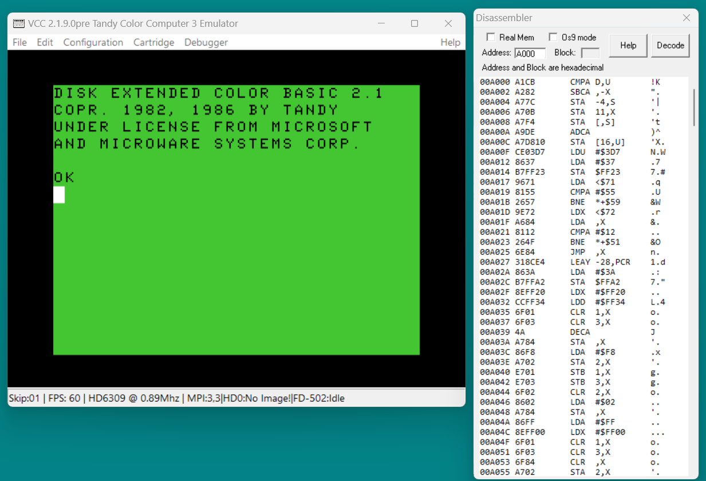

### Real vs CPU addressing

The disassembly above is shown using the CPU's view of memory.  Sometimes it is necessary to view real memory.  Real memory consists of many 8K blocks. The MMU can map only eight of them at a time to CPU memory.  The disassembler is capable of decoding programs in all of real memory. To see real memory press the 'M' key. This key toggles the disassembly address mapping between CPU and real mode.

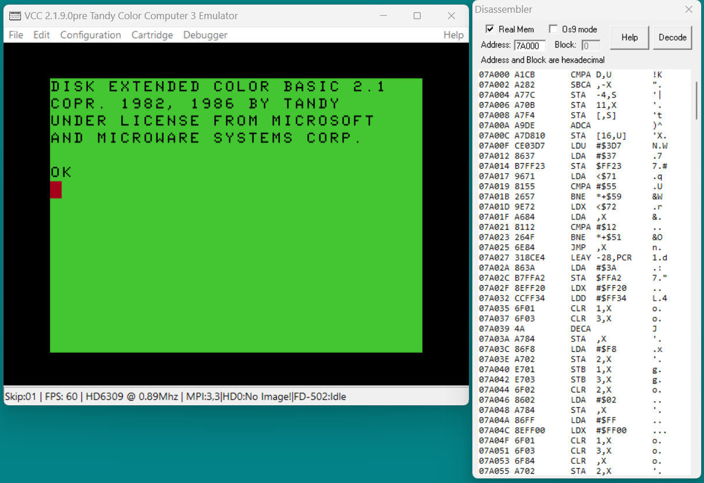

The disassembly is changed to show real addresses and the "Real Mem" box is now checked.  Note that checking or unchecking the "Real Mem" box does not remap the disassembly. You must use the "M" key to remap.

You can toggle between real and CPU mapping at will by pressing the "M" key however it will not always work.  If the real mode block displayed is not currently mapped to CPU memory remaping will fail with an error message.

-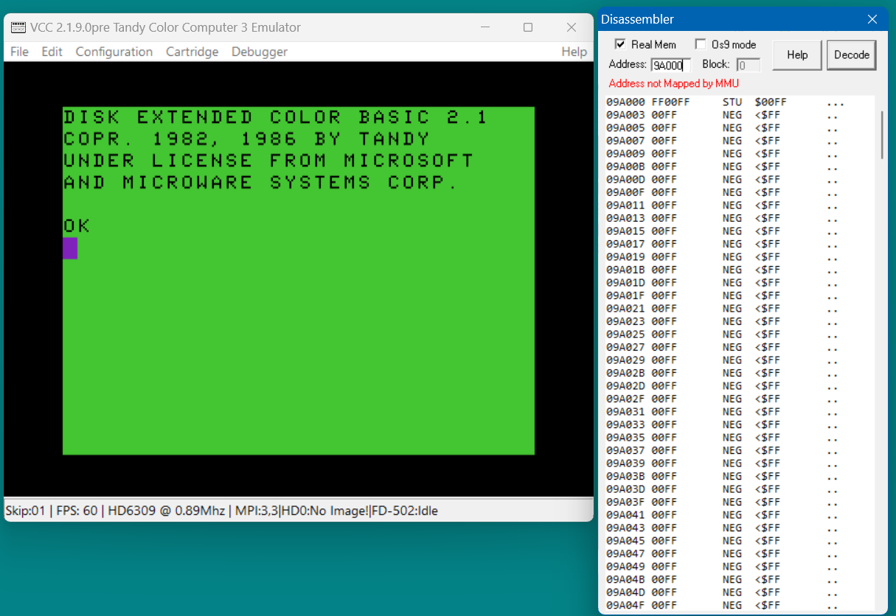

Here while in real mode I changed the address from 7A000 to 9A000 and hit enter to decode.  Then I tried "M" to remap and got an error.  When I changed the real address back to 7A000 the "M" toggle worked again because the block is mapped to the CPU.

### Pausing and viewing code.

Whenever the cpu is paused the Disassembler will switch to CPU addressing mode and then find and highlight the code at the current PC. This lets you see what the software was doing.  The Vcc "F7" key, "Pause" from the "File" menu, or the Disassembler 'P' key can be used to pause the CPU.

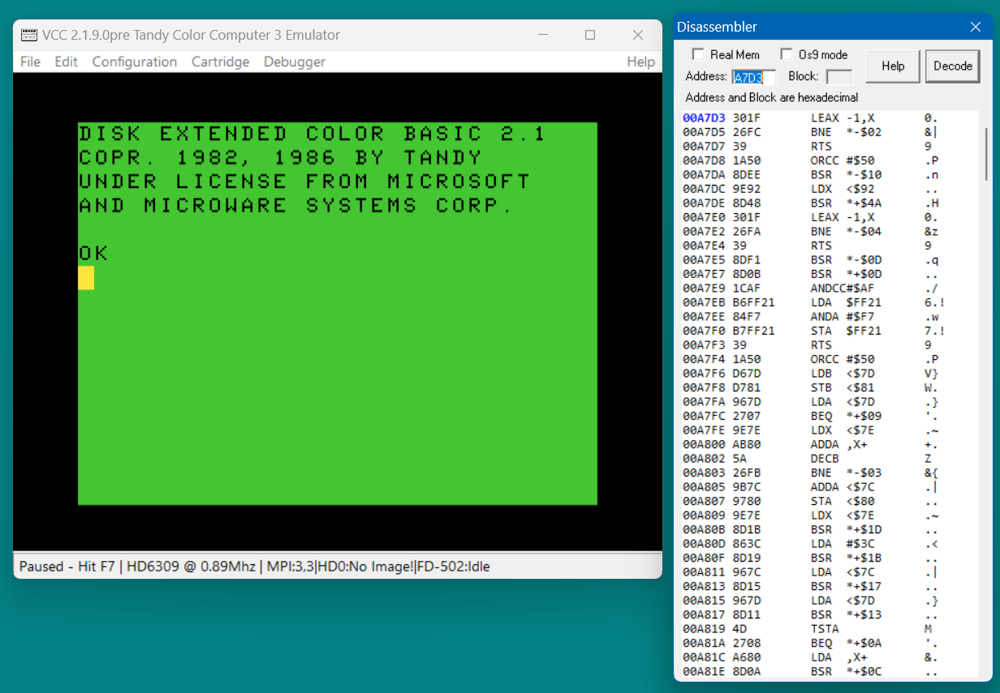

You can view the code that was executing at anytime by starting the Disassembler and pressing the 'P' key. The screenshot above shows the result if this is done while DECB is at the color prompt. In the Disassembler the address starting at A7D3 has automatically been decoded. The blue highlight indicates the program counter address. Pressing 'G' will unpause the CPU.  If you toggle pause several times you will notice the highlight goes away when the CPU is running and sometimes the PC pauses at A7D5 instead of A7D3. 

### The Processor State Window

The "Processor State" window shows the current CPU registor values.  If you press "I" from the disassembler window the processor state window will be launched without using VCC's Debugger memu.

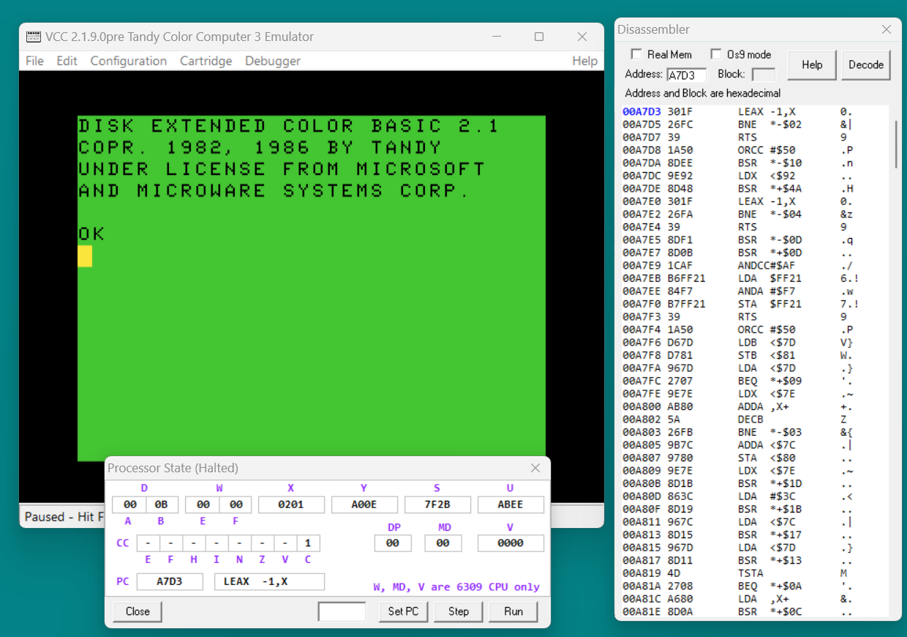

You can use Processor State "Step" button or the Disassembler 'S' key to step through code.  If you keep stepping you can see that the CPU is in a loop that changes the colors of the DECB cursor.  Most of the time the CPU running a timing subroutine that counts the X registor down to zero.

### Setting a breakpoint

With Vcc halted at the DECB promp set a breakpoint on the RTS instruction at A7D7.  Decode and use the mouse to click on the line containing the RTS and press the 'B' key.  The address at that line will turn red to indicate that there is a breakpoint there.  If you press the 'L' key a listbox will show all the break points that have been set.  (Don't worry about remembering all these keys, clicking on the HELP button will show them)

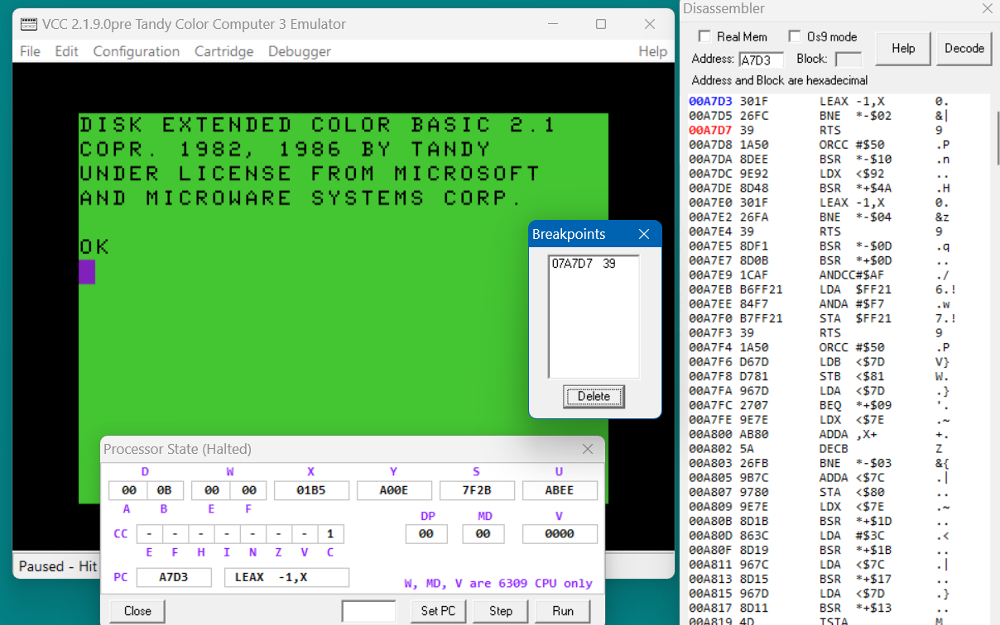

The "Breakpoints" listbox shows the breakpoint's real address and the original opcode.  A breakpoint can be removed by selecting it and pressing "Delete".

With the breakpoint set at address A7D7 use the "P" or Run button to start the CPU. The CPU immediatly pauses and the RTS instruction highlight has changed color from red to magneta.  It is that color because the PC is at the breakpoint. Notice that pressing "P" again and again seems to do nothing but if hold the hold "P" down to auto repeat you should see the DECB cursor occasionally changing color.  What is happening is the CPU is stopping everytime it encounters the breakpoint at the RTS.

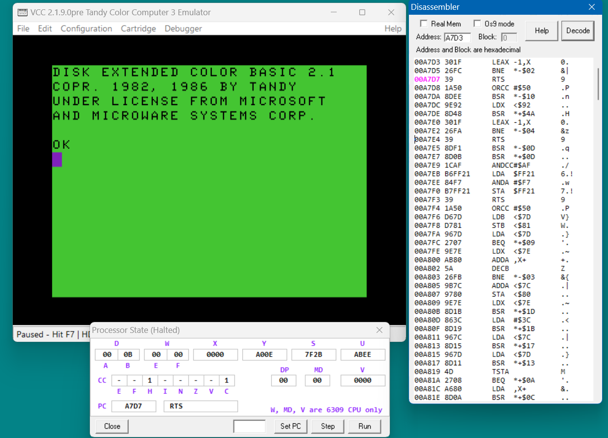

You can step however. This will step one instruction which will execute the RTS to return to the caller and stop.

The next instruction is another subroutine call. Steping again brings the PC to the first instruction in that subroutine.  The PC is now at the bottom of the disassembly. This is because the disassembler found the already decoded address and scrolled the text to make the line visible. You can continue to step though the code and the disassembler will continue to follow the program counter.

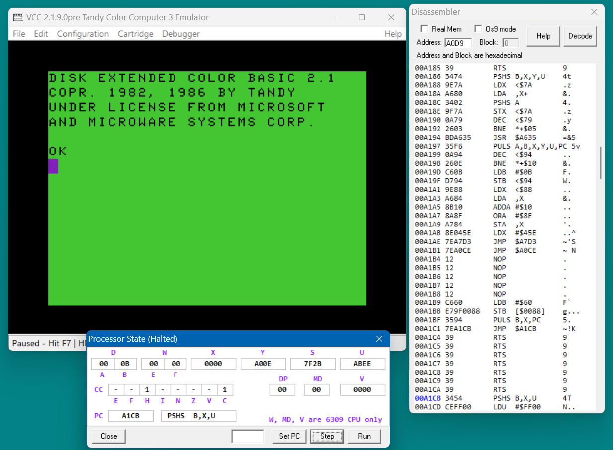

A breakpoint can be removed by selected it in the disassembly screen and pressing 'R' key. Or use the breakpoints listbox to select and delete it.  Also you can press the 'K' key to remove all breakpoints. Exiting the Disassembly screen will also remove them.

### Help Message Box

The "Help" button brings up a brief help message.

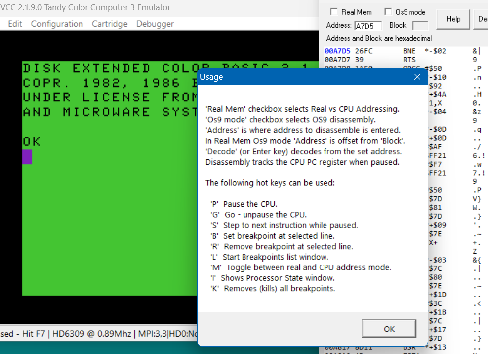

### Working with Nitros9

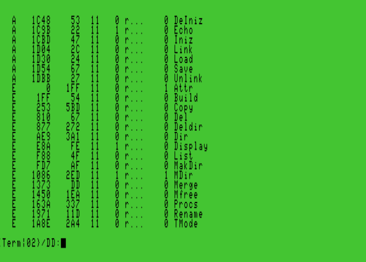

Working with Nitros9 can be difficult because it loads modules in real memory then maps them as needed.  In this example we are working with the "Attr" module. Here "mdir -e" shows that Attr is located in block "E" with an offset of "0". Is is likely that Attr will be loaded elsewhere on your system but the steps are the same.

Next I started the Disassembler window and checked both the "Real Mem" and "Os9 Mode" boxes.  I entered 'E' in the "Block" field and '0' in the "Address" field. Then I hit enter to get the disassembly.

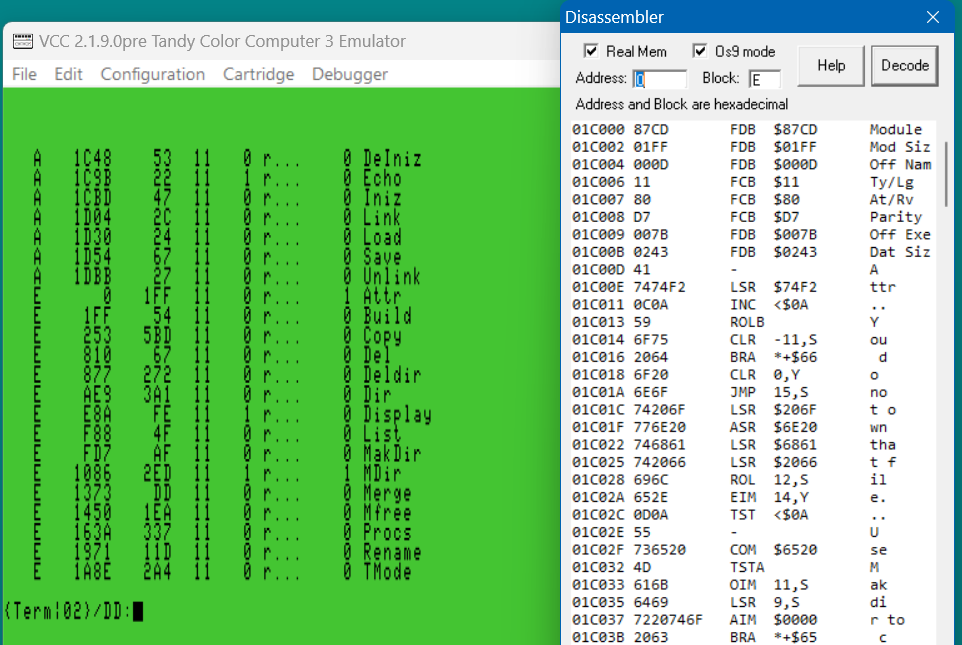

This shows one of the features of Os9 Mode, the Module header has been decoded.  Block and offset have been translated to real addresses.  At address 01C00D I can see that this is indeed the "Attr" module.

At 01C009 I see the execution offset is 007B.  I add this to the module start offset (cleverly I choose a module with an zero offset) and enter the result, 7B, in the Address field. Then I used the enter key to decode:

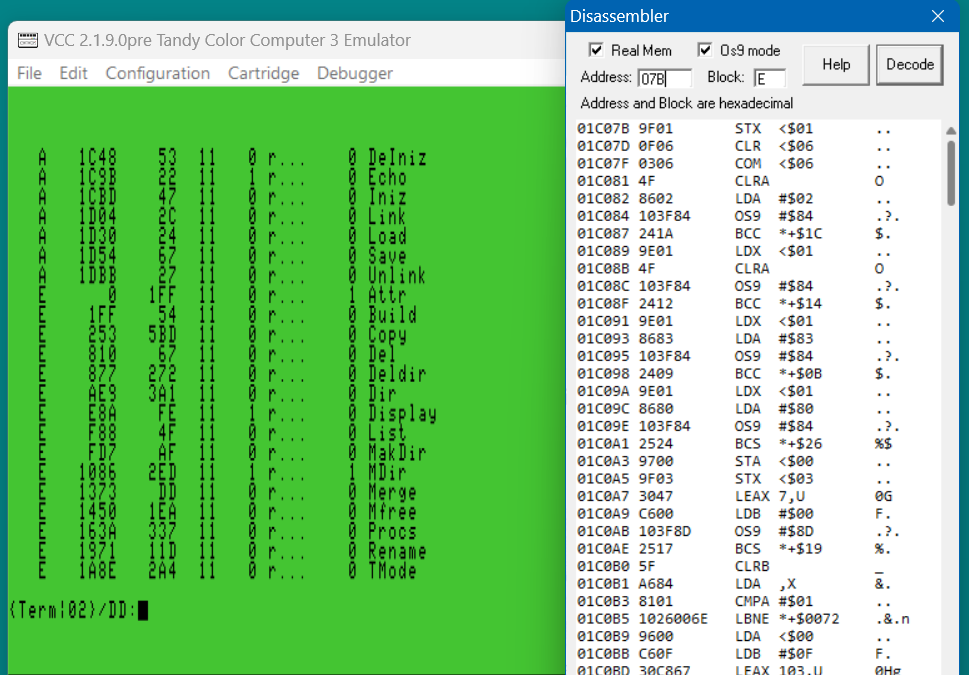

The disassembly now starts at 01C07B which is the start address of the Attr module. 

To debug it I set a breakpoint at 01C07B then from Nitros9 I run the Attr command.  The CPU halts at my breakpoint and the disassembly switches to CPU mode. I can then step through the code to watch it work:

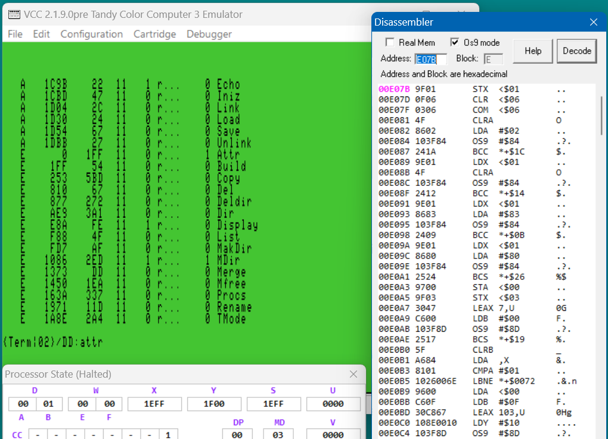

Here you can see another feature of Os9 Mode.  SWI2 instructions have been converted to "OS9" instructions.  'OS9 #$84' is a system call to open an existing file. 

That is all for now.  Enjoy!
